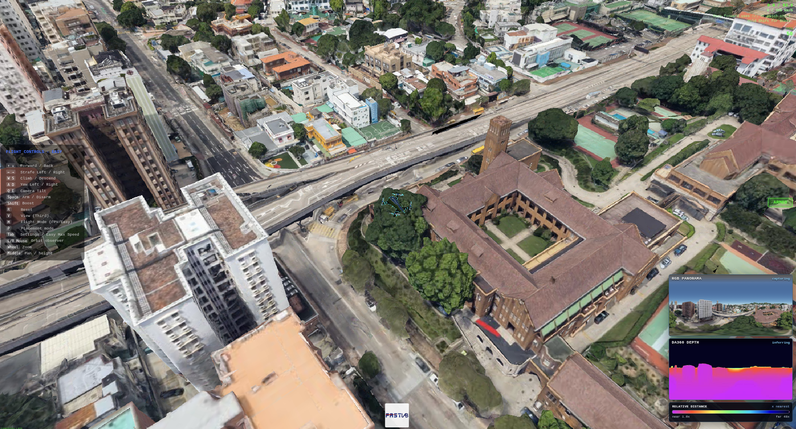
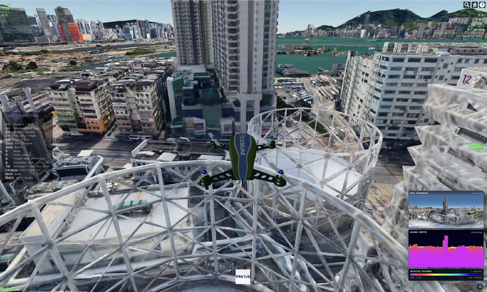
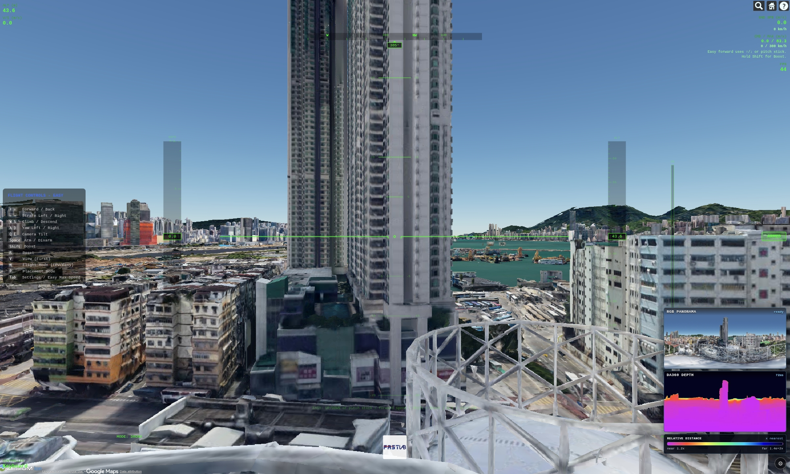

<div align="center">

**🌐 [English](README_EN.md) | [简体中文](README.md)**

</div>

# MindCloud World Fly with YOPO

浏览器中的 Google Photorealistic 3D Tiles 穿越机驾驶器，集成 YOPO 端到端神经网络自主导航（3D 避障）。进入页面后选择城市、放置出生点，然后用键盘、手柄或 RC 遥控器飞行，或设置目标点让 YOPO 自主导航。右下角可显示机头 360 ERP 全景 RGB 和 DA360 深度。

## 克隆仓库

```bash
git clone https://github.com/wuuwuu26/MindCloud_World_Fly_Private.git
cd MindCloud_World_Fly_Private
```

> 注意：DA360 的源码与权重均在 `.gitignore` 中（`third_party/DA360/`），克隆后需自行补齐 DA360 源码并运行下载脚本才能启用其深度服务。

## 快速开始（一键启动全部服务）

推荐使用 `restart_all.sh` 一次性拉起主进程、DA360 与 YOPO 三个服务：

```bash
./restart_all.sh
```

该脚本等价于依次启动：DA360 深度服务 → YOPO 导航服务 → 主飞行进程（`launch.sh`）。启动后浏览器打开 `http://127.0.0.1:8080`，点击 **Start Google 3D Tiles Flight**，进入放置模式设置出生点后按 `O` 起飞，即可用键盘飞行。

> YOPO 推理默认走 TensorRT 加速（引擎 `asset/yopo-trt/yopo_trt.pth` 已随仓库提供），`restart_all.sh` 检测到引擎即自动启用，无需额外操作；详情见「YOPO TensorRT 加速」。

```bash
# 常用方式
./restart_all.sh --detach          # 后台运行（Docker detach）

# 只重启部分服务（其余保留）
./restart_all.sh --no-da360        # 只重启 YOPO + 主飞行
./restart_all.sh --no-yopo         # 只重启 DA360 + 主飞行
./restart_all.sh --no-main         # 只重启 DA360 + YOPO

# 查看某服务日志（容器名见下方表格）
docker logs -f mindcloud-yopo-api

# 停止全部后台容器（与 restart_all.sh 的停止逻辑一致，带 -v 清理匿名卷）
docker rm -fv google-tiles-flight mindcloud-da360-api mindcloud-yopo-api
```

三个容器的名字由 [restart_all.sh](restart_all.sh) 顶部的 `MAIN_NAME` / `DA360_NAME` / `YOPO_NAME` 定义（与各入口脚本的默认容器名一致）：

| 容器名 | 用途 | 定义处 |
|--------|------|--------|
| `google-tiles-flight` | 主飞行进程（`http://127.0.0.1:8080`） | `launch.sh` 的 `NAME="${NAME:-google-tiles-flight}"` |
| `mindcloud-da360-api` | DA360 深度服务（`http://127.0.0.1:5688`） | `scripts/start_da360_api.sh` 的 `DA360_CONTAINER_NAME` |
| `mindcloud-yopo-api` | YOPO 避障后端（`http://127.0.0.1:5689`） | `scripts/start_yopo_api.sh` 的 `YOPO_CONTAINER_NAME` |

如需改名，可设置对应的环境变量覆盖（如 `DA360_CONTAINER_NAME=my-da360 ./restart_all.sh`），停止时请用改动后的名字。

若只想先飞（纯键盘/手柄/RC，不依赖子服务），也可单独运行主进程：

```bash
./launch.sh
```

## 模型权重

| 模型 | 是否随仓库提供 | 获取方式 |
|------|----------------|----------|
| YOPO 导航权重 | **是**（直接提交，≤100MB） | 克隆即得，位于 `third_party/yopo/saved/`（默认 `YOPO_40/epoch50.pth`） |
| YOPO TensorRT 引擎 | **是**（直接提交，≤100MB） | 位于 `asset/yopo-trt/yopo_trt.pth`（fp16）；由 `epoch50.pth` 转换，换 GPU/模型时重建，见「YOPO TensorRT 加速」 |
| DA360 深度权重 | 否（约 1.3GB，超限） | 下载脚本：`./scripts/download_da360_model.sh`（Google Drive，需 `gdown`） |

### YOPO 导航权重

已直接提交到仓库，克隆后即位于 `third_party/yopo/saved/YOPO_40/epoch50.pth`。默认路径见 `scripts/start_yopo_api.sh`（`YOPO_MODEL_PATH`），可用环境变量覆盖：

```bash
YOPO_MODEL_PATH=/abs/path/to/your_yopo.pth ./scripts/start_yopo_api.sh
```

### DA360 深度权重

因单文件超过 GitHub 100MB 限制，未纳入仓库，请运行下载脚本（需先 `pip install gdown`）：

```bash
./scripts/download_da360_model.sh
# 脚本会将权重放到 third_party/DA360/checkpoints/DA360_large.pth
```

## 环境要求

- Docker Engine
- 一个支持 WebGL 的现代浏览器（用于打开 `http://127.0.0.1:8080` 使用模拟器）
- 浏览器可以访问 Cesium Ion 和 Google 3D Tiles
- 本地开发模式需要 Python 3
- DA360 深度推理需要 NVIDIA GPU、NVIDIA Container Toolkit、Python 3 + pip，以及可访问模型下载地址的网络

### 已验证运行环境

本项目已在以下设备完整验证可运行（DA360 深度 + YOPO 导航 + 主飞行三者同时拉起）：

| 项目 | 配置 |
|------|------|
| GPU | NVIDIA GeForce RTX 4070 Laptop GPU（8 GB 显存） |
| 驱动 / CUDA | 595.84 / 13.2 |
| DA360 配置 | `DA360_large` + `DA360_INPUT_SCALE=0.65`（模型输入 672×336），单卡 8GB 下约 92% 占用 |
| YOPO 配置 | TensorRT 加速，`YOPO_VELOCITY=15` |

> 显存更小（如 6GB 及以下）的 GPU 可下调 `DA360_INPUT_SCALE` 或 `da360UploadScale` 降低占用；显存更充裕的卡可上调以提升深度精度。

## Docker 构建说明

本项目共三套独立构建的容器，各自的镜像名、基础镜像与重建触发方式都不同：

| 容器 | 镜像 | 基础镜像 | Dockerfile | 入口脚本 |
|------|------|----------|------------|----------|
| 主飞行进程 | `google-tiles-flight` | `tumgis/3dcitydb-web-map:alpine-v2.0.0`（自带 Node + Cesium） | `Dockerfile.cesium` | `launch.sh` |
| YOPO 避障后端 | `mindcloud-yopo` | `pytorch/pytorch:2.1.1-cuda12.1-cudnn8-runtime`（CUDA） | `Dockerfile.yopo` | `scripts/start_yopo_api.sh` |
| DA360 深度服务 | `mindcloud-da360` | `pytorch/pytorch:2.1.1-cuda12.1-cudnn8-runtime`（CUDA） | `Dockerfile.da360` | `scripts/start_da360_api.sh` |

### 主飞行进程（`Dockerfile.cesium`）

- 把整个项目 `COPY` 到容器内 `/var/www/google-tiles-flight`，`CMD node scripts/server.js` 启动 Express 静态服务（同时提供 `/api/path/*.json` 门路线路持久化 API），`EXPOSE 8000`。
- 由 `launch.sh` 触发构建：仅当镜像**不存在**或加了 `--rebuild` 时才 `docker build`，否则直接复用已有镜像。
- 运行时用只读卷挂载 `src/`、`index.html`，读写挂载 `asset/gate-paths`，因此**改前端 JS/HTML 无需重建镜像**——重启容器并在浏览器强刷（Ctrl+F5）即可生效。

### YOPO 避障后端（`Dockerfile.yopo`）

- 系统依赖：`libgl1-mesa-glx`、`libglib2.0-0`、`ca-certificates`；Python 依赖：`numpy<2`、`pillow`、`opencv-python-headless`、`scipy`、`flask`、`flask-cors`、`ruamel.yaml`、`websockets`。
- 镜像内直接拷入 `scripts/yopo_server.py` 与 `third_party/yopo/`（含权重）。
- `scripts/start_yopo_api.sh` 构建/运行要点：
  - 构建用 `--network=host`，让容器内 `127.0.0.1:7890` 能访问宿主机代理装 pip；并把宿主 `HTTP(S)/FTP/ALL/NO_PROXY` 转发为 build args（`YOPO_PIP_NO_PROXY=1` 可关闭）。
  - 触发重建：镜像不存在，或 `YOPO_FORCE_BUILD=1`；失败自动重试 `YOPO_BUILD_RETRIES`（默认 3）。
  - 运行时只读挂载模型权重、`yopo_server.py`、`third_party/yopo` 源码——**改 Python / 权重不用重建镜像**，重启容器即生效。
  - 端口 5689（HTTP）+ 5690（WebSocket）；默认 `--gpus all`，`YOPO_GPUS=none` 走 CPU。
  - 镜像内 TensorRT 固定为 `8.6.1`（兼容 CUDA 12.1，且匹配 `yopo_server` 的 TRT 8 加载 API）；TRT 8.6 pip 包不自带 cuDNN，复用镜像内 torch 捆绑的 cuDNN8 提供 `libcudnn.so.8`（见 `Dockerfile.yopo` 的 `LD_LIBRARY_PATH`）。TRT 推理加速见「YOPO TensorRT 加速」。

### DA360 深度服务（`Dockerfile.da360`）

- Python 依赖：`numpy<2`、`flask`、`flask-cors`、`opencv-python-headless`、`pillow`、`timm`、`tqdm`、`xformers`。
- `COPY third_party/DA360` 进镜像，但 DA360 源码在 `.gitignore` / `.dockerignore` 中，**构建前需先跑 `scripts/download_da360_model.sh`**（用 `gdown` 从 Google Drive 下载权重，并用 `git clone --depth 1` 拉取 DA360 源码）。
- `scripts/start_da360_api.sh` 构建/运行要点：
  - 构建网络与代理转发同 YOPO（`DA360_BUILD_NETWORK`；额外从 `git config` 探测宿主机代理 `DA360_BUILD_PROXY`）。
  - 会给镜像打 `mindcloud.da360.server_sha` label：已有镜像且 server 脚本 SHA 一致时**自动跳过重建**；`DA360_FORCE_BUILD=1` 或脚本内容变化才重建。
  - 构建失败时**默认不启动过期镜像**（可用 `DA360_ALLOW_STALE_IMAGE=1` 放宽）。
  - 端口 5688；运行时只读挂载 `da360_server.py` 与模型权重。

### 构建超时 / 失败的常见原因

- 两个 CUDA 后端的基础镜像 `pytorch/pytorch:2.1.1-cuda12.1-cudnn8-runtime` 体积很大，网络差时从 Docker Hub 拉取容易超时（`start_da360_api.sh` 失败提示中也直接点明了这一点）。
- 处理办法：脚本已内置 3 次重试，网络恢复后重跑即可；或保证本机 `127.0.0.1:7890` 代理可用；也可把 `YOPO_BASE_IMAGE` / `DA360_BASE_IMAGE` 指向本地或镜像源镜像。
- 装 pip 依赖失败时，请确认以 `--network=host` 构建且代理可达。

### `.dockerignore`

构建上下文排除了 `.git`、`node_modules`、`__pycache__`、`*.pyc`、`scene/*`、`asset/gate-paths/*.tmp`、`third_party/DA360`，避免把无关/大文件打进镜像。

## DA360 深度估计

DA360 深度服务由 `restart_all.sh` 一键拉起（默认使用 `large` 模型）。但因 DA360 源码与权重未纳入仓库（`.gitignore` / `.dockerignore`），**首次运行前需先下载模型与源码**，否则 `restart_all.sh` 的 DA360 构建会失败：

```bash
python3 -m pip install --user gdown
./scripts/download_da360_model.sh
# 脚本会将权重放到 third_party/DA360/checkpoints/DA360_large.pth
```

启动后心跳自检：

```text
curl http://127.0.0.1:5688/health
```

停止或重启 DA360 直接重跑 `restart_all.sh`（或 `docker rm -fv mindcloud-da360-api`）。

注意，默认使用 `DA360_large`，DA360 服务端以 `DA360_INPUT_SCALE=0.65` 推理，模型输入约为 `672x336`（checkpoint 基准 1036×518 × 0.65，按 patch=14 取整；已在本机 RTX 4070 Laptop GPU 8GB 上验证可稳定运行）。全景 RGB 默认 `768x384` ERP，右下角显示即此原始尺寸；只有发送给 DA360 的深度请求会单独缩小，前端默认按 `da360UploadScale=0.5` 上传 `384x192` 的 JPEG，再由服务端 resize 到 `672x336` 模型输入、推理后将深度贴回 `384x192`（恰好等于 YOPO 消费的 384×192 ERP 深度）。前端默认 `depthMs=33`（深度请求最小间隔 ≈30Hz），推理未完成时不会堆积请求。

默认不建议换模型；实验中 `DA360_large` 的 fast 档比 `DA360_small` 保留了更好的深度排序和边缘一致性。只有显存、功耗或部署体积受限时，再自行覆盖模型名：

```bash
DA360_MODEL=<large|base|small> ./scripts/download_da360_model.sh
DA360_MODEL=<large|base|small> ./scripts/start_da360_api.sh
```

如需主动调整 DA360 服务端模型输入尺寸，可设置推理 scale 或指定模型输入宽高；过低的 `DA360_INPUT_SCALE` 可能让 large 模型输出条带化深度，不建议低于 `0.46`。服务端 resize 默认使用 `DA360_RESAMPLE=bicubic`，与 DA360 原项目的输入缩放方式保持一致：

```bash
DA360_INPUT_SCALE=1.0 ./scripts/start_da360_api.sh
DA360_INPUT_SCALE=0.46 ./scripts/start_da360_api.sh
DA360_INPUT_WIDTH=476 ./scripts/start_da360_api.sh
DA360_INPUT_WIDTH=672 DA360_INPUT_HEIGHT=336 ./scripts/start_da360_api.sh
DA360_RESAMPLE=bilinear ./scripts/start_da360_api.sh
```

推理服务不在本机时：

```text
http://127.0.0.1:8080/?da360Url=http://<host>:5688/depth
```

## 使用流程说明

1. 点击 **Start Google 3D Tiles Flight**。
2. 等页面进入 **PLACEMENT MODE**。
3. 用 Cesium 搜索框搜索城市或地点。
4. 按住 `I` 并点击建筑、道路或地面设置出生点。
5. 用 `W/A/S/D` 微调水平位置，`Shift` 加快微调。
6. 设置 **SPAWN ALTITUDE (m)**。
7. 按 `O` 确认出生点。
8. 选择 **First Person** 或 **Third Person** 开始飞行。

常用按键：

```text
↑ / ↓       前进 / 后退
← / →       左右平移
W / S       上升 / 下降
A / D       左右偏航
Shift       加速
R           重置
V           切换视角
P           返回放置模式
Tab         设置面板
```

键盘可直接使用，也支持手柄（但需要自己优化映射），手柄通常会被 Chrome 的 Gamepad API 自动识别。RC 遥控器或 WebHID 设备可在设置面板中连接；如需检查 Linux 输入权限：

```bash
./launch.sh --input-status
./launch.sh --setup-input
```





## 全景相机实现原理

全景 RGB 默认从机头 360 相机位置采集，输出 `768x384` ERP 图。实现方式是对 Cesium/Google Tiles 渲染结果进行 6 个方向采样，然后在 GPU 中按 ERP 射线模型重投影：

```text
yaw   = pi - (u + 0.5) / W * 2pi
pitch = vfov / 2 - (v + 0.5) / H * vfov
```

这保证投影模型与 YOPO 原版的 ERP 相机一致；区别是数据来源为 Cesium 渲染视图，而不是仿真栅格的直接 raycast。放置阶段会后台创建全景采样 viewer；确认出生点后会在用户可控前预采样一张全景首帧。飞行中默认 `panoMs=16`、`panoFace=192`、每个采样方向等待 `panoFrameDelayMs=8`，并最多等待 `panoFaceTileTimeoutMs=900` 让当前方向 tiles idle；首帧预加载使用 `panoPreloadFrameDelayMs=96`、`panoPreloadFaceTileTimeoutMs=6000` 和 `panoPreloadTimeoutMs=60000`，默认 `panoPreloadRequired=1`，未拿到完整 6 面首帧不会进入可控飞行。为了避免 Google Tiles 天空/极区采样在 ERP 顶部形成海市蜃楼状伪影，默认对顶部 10 度和底部 2 度做极区 guard；guard 区域保持 ERP 坐标，只向上下极点采样淡出，不会把整张图压缩到 guard 边界。可用 `panoTopPoleGuard` / `panoBottomPoleGuard` 调整或设为 0 关闭。

进入可控飞行前，主 Cesium 视图会预加载出生点周围区域，并分别等待第一人称和第三人称初始视角 tiles idle。默认 `flightPreloadStrict=0`，主视图只要目标区域覆盖率达标就继续；全景首帧预加载独立检查隐藏 viewer 的 6 个方向 tiles idle。只有显式设置 `?panoPreloadRequired=0` 时，才会允许全景首帧失败后进入飞行并让实时采样继续重试。

常用参数：

```text
# 更高输出分辨率
http://127.0.0.1:8080/?panoWidth=1036&panoFace=768

# 调整采样视图等待时间
http://127.0.0.1:8080/?panoFrameDelayMs=16&panoPreloadFrameDelayMs=120

# 调整首帧全景预加载超时；或允许首帧失败后继续进入飞行
http://127.0.0.1:8080/?panoPreloadTimeoutMs=90000&panoPreloadFaceTileTimeoutMs=9000
http://127.0.0.1:8080/?panoPreloadRequired=0

# 调整起飞前主视图预加载范围和覆盖率门槛
http://127.0.0.1:8080/?flightPreloadRadius=600&flightPreloadMinCoverage=0.98

# 调整 RGB / 深度更新间隔
http://127.0.0.1:8080/?panoMs=1000&depthMs=1200

# 调整 ERP 极区 guard
http://127.0.0.1:8080/?panoTopPoleGuard=0&panoBottomPoleGuard=0

# 调整仅用于 DA360 的上传尺寸或缩放，不影响 RGB 全景显示
http://127.0.0.1:8080/?da360UploadScale=0.35
http://127.0.0.1:8080/?da360UploadWidth=672
```

## YOPO 自主导航

基于 YOPO 端到端导航网络，无人机可自主飞行到指定目标点。YOPO 接收 ERP 全景深度图、里程计和目标点，输出位置/速度/加速度/偏航指令，通过 SimpleFlight 级联 PID 控制器驱动无人机。

### 导航架构（对齐 YOPO 原版）

- **网络输入**：`depth (1,2,192,384)`（通道 0 = 归一化深度，通道 1 = 有效 mask）+ 9 维观测（相机系速度/加速度/目标方向），经 `prepare_input` 展开为 `(1,9,6,12)`。
- **轨迹选择（服务端：纯 YOPO argmin）**：网络输出 72 条候选轨迹（12 水平 × 6 垂直锚点）的终端状态（PVA）+ score。**服务端严格遵循 YOPO 原版 `test_yopo_ros.py` 部署实现，直接 `argmin(score)` 选最优轨迹**，不叠加任何几何碰撞代价。避障的第一层完全由网络在训练期 `safety_loss` 中学到的 score 提供（**学习式避障**），与官方部署实现完全一致。
- **客户端反应式安全层（几何势场）**：在服务端轨迹之上，前端 `src/drone.js` 额外叠加一层基于 Cesium 射线环的几何反应式避障，用于兜住深度重规划（约 70 ms/次）间隙内的突发近障。路径畅通时该层自动完全归零、不干扰网络规划，详见「避障架构与调参」。
- **目标引导**：score 内已含目标方向代价（训练时 `wg=0.15`），网络原生指向目标。
- **3D 导航**：不做水平面投影，垂直避障由网络预测的 z 终端状态决定。
- **轨迹生成**：三轴五阶多项式（Poly5Solver），从上次指令状态出发（`plan_from_reference=True`），轨迹连续、无往复。
- **控制输出**：50Hz 评估多项式 → 位置/速度/加速度 + 偏航 → 前端级联 PID 跟踪。
- **保护逻辑**：深度异常（整帧被 2m 内包围）悬停等待；终点接管（< 12m）跳过网络推理，直接规划终端速度/加速度为 0 的五次多项式平滑减速到目标点。

### 避障架构与调参

避障分两层，职责不重叠：

| 层 | 位置 | 机制 | 作用 |
|----|------|------|------|
| 学习式避障 | 服务端 `scripts/yopo_server.py` | 网络 `argmin(score)` 选轨迹（训练期 `safety_loss`） | 全局路径规划、绕开大尺度结构 |
| 几何反应式势场 | 前端 `src/drone.js` | 360° 射线环（36 条、10° 间隔）实时探测 | 兜住深度重规划间隙内的突发近障 |

客户端几何层工作机制（见 `_avoidanceVelocity`）：

- **探测**：以机体为圆心发 36 条水平射线（半径 35 m）；对最对齐前进方向的 3 条额外做上/下两层探测（供竖直越障判断）；另有正上/正下竖直射线。
- **输出分量**：`rep`（径向推离）/ `tan`（切向绕行）/ `brake`（近障刹车）/ `vRep`（竖直越障）/ `vGo`（竖直障碍足迹水平绕行）/ `upPush` + `vSafeDown`（地面与下降安全）。
- **刹车**：运动学硬刹车 `v_safe = √(2·a·(d − standoff))` 保证物理上刹得住；再叠加 12 m 内的渐进软刹车（下限 55%）做舒适减速。
- **侧向速度预算**：绕行时把"前进"与"侧向绕行"拆开预算——侧向最多占速度上限的 55%、前向至少保留 30%，让速度矢量真正偏向切向、贴着障碍滑过，而不是"边全速前冲边轻蹭"。
- **畅通直飞（`goalClear`）**：以"机体→目标"和"命令速度方向"做双走廊判定（走廊半宽 2.5 m，20 m 内无障即畅通）。**通道畅通时 `rep`/`tan`/`brake`/`vRep` 全部归零、`vGo` 被抑制**，无人机全速直飞目标，不会被无谓推离或莫名绕行。

关键参数（均位于 `src/drone.js` 构造函数）：

| 参数 | 默认值 | 含义 |
|------|--------|------|
| `yopoAvoidEnabled` | `true` | 几何层总开关 |
| `yopoAvoidRayCount` | 36 | 360° 射线数（10° 间隔） |
| `yopoAvoidRange` | 35.0 | 障碍探测半径 (m) |
| `yopoAvoidRepRange` | 20.0 | 排斥/切向/刹车作用距离 (m) |
| `yopoAvoidRepGain` | 12.0 | 径向推离最大速度 (m/s) |
| `yopoAvoidTanGain` | 30.0 | 切向绕行增益 (m/s)，越大绕得越果断 |
| `yopoAvoidDecel` | 8.0 | 刹车阈值所用假定减速度 (m/s²) |
| `yopoAvoidVClear` | 0.38 | 上层"畅通"判定占比，越低越障意愿越强 |
| `yopoAvoidVClimbScale` | 1.9 | 竖直越障爬升力度 |
| `droneMaxVSpeed` | 14.0 | 竖直速度硬上限 (m/s) |

> **调参建议**：绕行不够果断请调大 `yopoAvoidTanGain`（力度）；**不要**调 `yopoAvoidRepRange`——它同时是 `goalClear` 的畅通判定阈值，调大会让"路径其实畅通"时误判被挡。改前端参数后需浏览器 **Ctrl+F5 强刷**生效。

### 启动 YOPO 后端

> YOPO 避障后端由 `restart_all.sh` 一键拉起（默认启用 TensorRT + `YOPO_VELOCITY=15`）；以下命令仅在需要手动单独构建/启动时使用。

```bash
# 首次需要构建 Docker 镜像
YOPO_FORCE_BUILD=1 ./scripts/start_yopo_api.sh

# 后续启动（自动跳过构建，挂载本地 yopo_server.py）
./scripts/start_yopo_api.sh

# 构建时如遇代理问题，确保本机 7890 端口代理可用
# Dockerfile.yopo 使用 --network=host + http://127.0.0.1:7890
```

服务运行在 `http://127.0.0.1:5689`。`yopo_server.py` 通过 Docker volume 挂载，修改后无需重建镜像。

### YOPO 后端关键环境变量

由 `scripts/start_yopo_api.sh` 转发进容器：

| 变量 | 默认值 / 推荐值 | 说明 |
|------|------------------|------|
| `YOPO_VELOCITY` | 15.0（`restart_all.sh` 设定） | 网络规划巡航速度 `vel_max` (m/s)，决定实际飞行速度；环境未设时回退到 yaml 配置值 |
| `YOPO_CTRL_TIME_SCALE` | 1.0 | 指令"快进"倍率。`>1` 会按 `vel_max × SCALE` 推进（2 即 ≈30 m/s），虽被 `YOPO_SPEED_CAP` 钳回，但会造成规划位置超前、无人机持续追迹滞后，故保持 1 |
| `YOPO_SPEED_CAP` | 15.0 | 指令速度绝对硬上限 (m/s)，保证"所有限速最高到 15 m/s" |
| `YOPO_TRAJ_EXTEND_S` | 2.0 | 轨迹末端外推时长 (s)，修重规划间隔内的指令冻结锯齿；超时仍无重规划则退回冻结行为，避免无限盲飞 |
| `YOPO_USE_TRT` | 1（`restart_all.sh` 设定） | TensorRT 加速开关，见「YOPO TensorRT 加速」 |

> 反应预算限速器（原按重规划间隔动态限速）已移除：飞行速度直接由 `YOPO_VELOCITY × YOPO_CTRL_TIME_SCALE` 决定，并受 `YOPO_SPEED_CAP` 硬钳制；避障改由「服务端网络 `argmin(score)` + 客户端几何反应式势场」两层共同保证（见「避障架构与调参」）。

### YOPO TensorRT 加速

YOPO 推理默认走 TensorRT（TRT）加速。将 `epoch50.pth` 固化为 fp16 引擎后，单次推理延迟从 PyTorch eager 的约 100~350ms 降到 1~5ms，使导航重规划更频繁、盲飞段更短、避障更顺。

- **引擎路径**：`asset/yopo-trt/yopo_trt.pth`（已提交；fp16，绑定本机 GPU 架构）。
- **一键启用**：`restart_all.sh` 检测到引擎存在即自动设 `YOPO_USE_TRT=1`，启动后后端日志打印 `[TensorRT] 已加载 … 推理加速启用`。强制退回 PyTorch eager：
  ```bash
  YOPO_USE_TRT=0 ./restart_all.sh
  ```
- **自动构建**：若启用 TRT 但引擎缺失，`scripts/start_yopo_api.sh` 会在 YOPO 容器内用 GPU 自动把当前模型（`YOPO_MODEL_PATH`，默认 `epoch50.pth`）固化为引擎并写入 `asset/yopo-trt/`（读写挂载），下次启动直接加载，无需手动预处理。
- **手动转换**：更换模型或重建引擎时，在带 GPU 的容器内运行转换脚本（`scripts/yopo_trt_transfer.py`：`epoch50.pth` → `torch.onnx.export`（`depth[1,2,192,384]` + `obs[1,9,6,12]`）→ TRT fp16 引擎，兼容 TRT 8.x / 10+）：
  ```bash
  docker run --rm --gpus all \
    -v "$PWD/third_party/yopo:/opt/mindcloud-yopo/third_party/yopo:ro" \
    -v "$PWD/scripts/yopo_trt_transfer.py:/opt/mindcloud-yopo/scripts/yopo_trt_transfer.py:ro" \
    -v "$PWD/third_party/yopo/saved/YOPO_40/epoch50.pth:/models/epoch50.pth:ro" \
    -v "$PWD/asset/yopo-trt:/opt/mindcloud-yopo/trt:rw" \
    mindcloud-yopo:latest python /opt/mindcloud-yopo/scripts/yopo_trt_transfer.py \
      --model /models/epoch50.pth --out /opt/mindcloud-yopo/trt/yopo_trt.pth
  ```
- **换 GPU / 架构**：TRT 引擎与 GPU 的 SM 计算能力绑定，当前引擎在 RTX 4070 上构建。部署到 Orin NX 或其它卡时，在目标机删除旧引擎并让 `start_yopo_api.sh` 自动重建（或重新跑上面命令）。
- **环境约束**：容器内 TensorRT 固定为 `8.6.1`（匹配 CUDA 12.1 运行时与 `yopo_server` 的 TRT 8 加载 API）；TRT 8.6 pip 包不自带 cuDNN，转而复用镜像内 torch 捆绑的 cuDNN8 提供 `libcudnn.so.8`（见 `Dockerfile.yopo` 的 `LD_LIBRARY_PATH`）。

### 目标点选择与导航

1. 飞行模式下，按 **`T`**（或点击右侧 YOPO 面板 **"Pick Target"**）开始设置目标。
2. 目标初始位置为无人机当前位置，用**数字键盘**移动（方向以**无人机当前机头朝向**为前方）：
   - `Numpad 8 / 2`：沿机头方向前进 / 后退
   - `Numpad 4 / 6`：垂直机头方向左移 / 右移
   - `Numpad 9 / 3`：上升 / 下降
3. **`Numpad 5`**：确认目标点并**自动开始导航**。
4. **`Numpad 0`** 或 **`Esc`**：取消选择。

导航期间：
- 无人机使用 YOPO 轨迹指令 + 速度前馈跟踪路径
- 推动摇杆临时切换人工控制（松杆恢复导航）
- **避障（服务端学习式 + 客户端几何反应式，双层）**：服务端严格遵循 YOPO，按
  `argmin(score)` 选轨迹（学习式避障）；客户端在跟踪指令的同时，叠加一层几何
  反应式势场（360° 射线环：径向推离、切向绕行、近障刹车、竖直越障、竖直障碍
  足迹绕行），用于兜住深度重规划间隙内的突发近障。去往目标的水平通道畅通时该
  几何层自动归零、不干扰导航，详见「避障架构与调参」。
- 到达目标 2m 内自动标记到达
- 按 **`X`**（或点击 **"Stop Nav"**）结束导航

目标点标记在导航、到达后、停止后均保持可见，直到重新选取或取消目标，因此第二次导航时仍能看到目标位置。

### 俯视小地图（目标地图）

主界面左下角常驻一块 **Target Map (Top-Down)** 俯视小地图，飞行中实时刷新，用于直观掌握无人机与目标点的相对位置：

- 地图以无人机为中心，按水平面投影显示无人机当前朝向、目标点位置，以及两者连线。
- 地图下方两行文字分别给出**目标高度 y**（目标点在 Cesium 坐标系下的高度，单位 m）和**坐标差 Δx/Δy/Δz to target**（目标相对无人机的东/上/北方向位移，单位 m）。
- 进入目标选择模式（按 `T`）后，地图会随数字键盘对目标点的移动同步更新，方便在空间上对齐目标。
- 该小地图不含任何数据归属水印，纯前端绘制，不依赖外部地图服务。

### 深度图

YOPO 需要 **384×192 ERP 全景深度图**（YOPO 原生输入格式），双通道：通道 0 = 归一化深度 [0,1]，通道 1 = 有效 mask。获取流程：

1. DA360 全景深度估计 → ERP 深度图（米制）
2. 前端重投影/裁剪为 384×192 ERP，附加有效 mask
3. 直接作为网络输入（无 Cesium 射线参与）

**深度不可用时（DA360 失败/超时）不回退 Cesium 射线检测**——YOPO 的网络输入仍要求真实深度，此时无人机原地悬停并持续重试，直到拿到有效深度图才恢复导航。

> 这与客户端几何反应式避障互不冲突：后者（见「避障架构与调参」）是独立的安全兜底层，用 Cesium 射线环实时探测、不依赖 DA360 深度，也不参与网络输入。

### 坐标系

| 坐标系 | x | y | z | 前向 |
|--------|---|---|---|------|
| MindCloud / Cesium | 东 | 上 | 北 | -z |
| YOPO / ROS FLU | 前 | 左 | 上 | +x |

目标点在 MindCloud 坐标系下设置，服务端自动转换。
