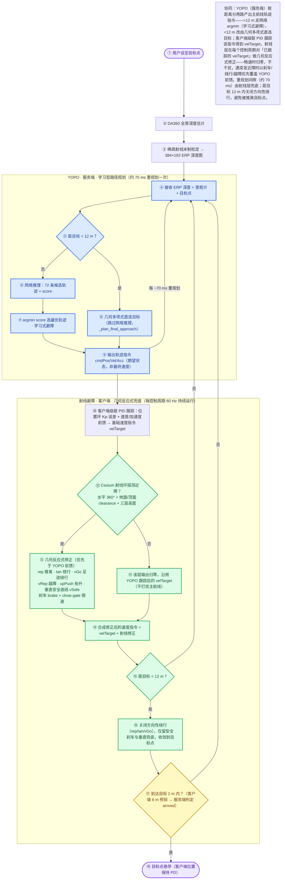

<div align="center">

**🌐 [English](README_EN.md) | [简体中文](README.md)**

</div>

# MindCloud World Fly with YOPO


> **YOPO 导航界面展示**：右下角为机头 360° ERP 全景 RGB 与 DA360 深度图，左下角为 Target Map 俯视小地图（无人机与目标点的相对位置），右侧面板用于选取目标点、开始/停止导航，并显示导航状态、到目标距离与推理计数。

[🎬 点击观看功能演示（连续避障 140MB + 脱困逃逸 60MB + 长距离飞行·洛杉矶 560MB + 长距离飞行·纽约 380MB + 长距离飞行·悉尼 315MB + 长距离飞行·伦敦 456MB 高清）](https://wuuwuu26.github.io/MindCloud_World_Fly_Private/video.html)

浏览器中的 Google Photorealistic 3D Tiles 穿越机驾驶器，集成 YOPO 端到端神经网络自主导航（3D 避障）。进入页面后选择城市、放置出生点，然后用键盘、手柄或 RC 遥控器飞行，或设置目标点让 YOPO 自主导航。右下角可显示机头 360 ERP 全景 RGB 和 DA360 深度。


**目录**

- [环境要求](#环境要求)
- [导航总览（YOPO 与射线避障如何分工）](#导航总览yopo-与射线避障如何分工)
- [从零开始（首次部署）](#从零开始首次部署)
- [如何停止](#如何停止)
- [使用流程说明](#使用流程说明)
- [模型权重](#模型权重)
- [Docker 构建说明](#docker-构建说明)
- [俯视小地图（目标地图）](#俯视小地图目标地图)
- [坐标系](#坐标系)
- [全景相机实现原理](#全景相机实现原理)
- [DA360 深度估计](#da360-深度估计)
- [输入给 YOPO 的深度图](#输入给-yopo-的深度图)
- [YOPO 自主导航](#yopo-自主导航)

## 环境要求

必需：

- Docker Engine（建议 24+），且当前用户有权限执行 `docker`（加入 `docker` 组）
- NVIDIA GPU + 驱动（DA360 / YOPO 需要）+ NVIDIA Container Toolkit（容器用 GPU）
- 磁盘 ≥80 GB：三个镜像实测共约 64 GB（YOPO ≈35 GB、DA360 ≈28 GB、主飞行 ≈1 GB），另加 1.3 GB DA360 权重
- 一个支持 WebGL 的现代浏览器（用于打开 `http://127.0.0.1:8080` 使用模拟器）
- 浏览器可访问 Cesium Ion、Google 3D Tiles 与 `cdn.jsdelivr.net`（PlayCanvas 前端库）

可选 / 特定场景：

- `curl`：`restart_all.sh` 用它等待服务就绪（一般系统自带）
- 本地开发模式（`./launch.sh --local`）需要 Python 3
- 下载 DA360 权重需要 Python 3 + pip（`gdown`）、`git`（下载脚本缺少 `git` 时会提前中止）以及可访问 Google Drive 的网络

> 首次部署的完整安装命令见「从零开始（首次部署）→ 第 0 步：安装前置软件」。

### 已验证运行环境

本项目已在以下设备完整验证可运行（DA360 深度 + YOPO 导航 + 主飞行三者同时拉起）：

| 项目 | 配置 |
|------|------|
| GPU | NVIDIA GeForce RTX 4070 Laptop GPU（8 GB 显存） |
| 驱动 / CUDA | 595.84 / 13.2 |
| DA360 配置 | `DA360_large`，推理尺寸 = 上传图原生尺寸对齐到 14 的倍数（默认 384×192 → 378×196），单卡 8GB 下约 92% 占用 |
| YOPO 配置 | TensorRT 加速，`YOPO_VELOCITY=15` |

> 显存更小（如 6GB 及以下）的 GPU 可下调前端 `da360UploadScale` / `panoWidth` 来降低上传与推理尺寸（从而降低占用）；显存更充裕的卡可上调以提升深度精度。注意 `DA360_INPUT_SCALE` 等服务端变量对推理分辨率无效，详见「DA360 深度估计」。

## 导航总览（YOPO 与射线避障如何分工）

下图说明一次自主导航里，YOPO（服务端·学习型路径规划）与射线避障（客户端·几何反应式兜底）各自负责什么、如何协同：



## 从零开始（首次部署）

下面按「一台全新机器 → 能手动飞 + 能 YOPO 自主导航」的顺序走一遍，包含 Docker / NVIDIA Container Toolkit 安装、拉取代码、权重下载和首次镜像构建。**首次部署完成后，日常只需 `./restart_all.sh`**（见「日常启动 / 部分重启 / 停止」）。

### 第 0 步：安装前置软件

```bash
# 1) Docker Engine（其它系统见 https://docs.docker.com/engine/install/）
curl -fsSL https://get.docker.com | sh
sudo usermod -aG docker "$USER"    # 注销并重新登录后生效
newgrp docker                      # 或只在当前 shell 临时生效

# 2) NVIDIA 驱动（能跑 nvidia-smi 即可）
nvidia-smi

# 3) NVIDIA Container Toolkit（让容器能用 GPU）
sudo apt-get update && sudo apt-get install -y nvidia-container-toolkit
sudo nvidia-ctk runtime configure --runtime=docker
sudo systemctl restart docker

# 4) 验证容器里能看到 GPU
docker run --rm --gpus all nvidia/cuda:12.1.1-base-ubuntu22.04 nvidia-smi
```

其它必要条件：

| 项目 | 要求 |
|------|------|
| 磁盘 | 三个镜像实测共约 **64 GB**（YOPO ≈35 GB、DA360 ≈28 GB、主飞行 ≈1 GB），再加 1.3 GB 的 DA360 权重，**建议预留 ≥80 GB** |
| 网络 | 首次需从 Docker Hub 拉基础镜像、从 Google Drive 拉权重；浏览器需能访问 Cesium Ion / Google 3D Tiles 与 `cdn.jsdelivr.net`（PlayCanvas） |
| `curl` | `restart_all.sh` 用它等待服务就绪（一般系统自带） |
| `python3` + `gdown` | 仅下载 DA360 权重时需要 |

> 只想先用键盘飞（不跑 DA360 / YOPO）的话，可以跳过 GPU 与权重相关步骤，直接 `./launch.sh`，只构建约 1 GB 的主飞行镜像。

### 第 1 步：拉取代码

```bash
git clone https://github.com/wuuwuu26/MindCloud_World_Fly_Private.git
cd MindCloud_World_Fly_Private
```

> 注意：DA360 的**源码**已随仓库纳入版本管理（对 DA360 而言 `.gitignore` 忽略权重目录 `third_party/DA360/checkpoints/` 及 `third_party/DA360/data/images/Thumbs.db`，完整忽略清单见仓库根目录 `.gitignore`），克隆后即可获得源码；但**权重**（`DA360_large.pth`，约 1.3GB，超 GitHub 100MB 限制）未入库，需在第 2 步下载。

### 第 2 步：下载 DA360 深度权重

YOPO 权重与 TRT 引擎已随仓库提供，**只有 DA360 权重**（约 1.3 GB）需要单独下载：

```bash
python3 -m pip install --user gdown
./scripts/download_da360_model.sh
# 写入 third_party/DA360/checkpoints/DA360_large.pth
```

DA360 源码已随仓库提供，脚本检测到源码存在时只下载权重。

### 第 3 步：一键启动（首次会自动构建三个镜像）

```bash
./restart_all.sh
```

脚本依次拉起：DA360 深度服务 → YOPO 导航服务 → 主飞行进程。各入口脚本**只在镜像不存在时才构建**，所以首次会比较慢（主要是拉取 CUDA 基础镜像 + 装 pip 依赖，通常需要几十分钟），之后都是秒级重启。

构建/启动日志分别落在：

```bash
tail -f /tmp/restart_da360.log
tail -f /tmp/restart_yopo.log
tail -f /tmp/restart_main.log
```

也可以提前或单独构建某一个镜像：

```bash
./launch.sh                                      # 主飞行镜像（缺镜像才构建；加 --rebuild 强制）
YOPO_FORCE_BUILD=1 ./scripts/start_yopo_api.sh   # YOPO 镜像
DA360_FORCE_BUILD=1 ./scripts/start_da360_api.sh # DA360 镜像
```

> YOPO 推理默认走 TensorRT 加速（引擎 `asset/yopo-trt/yopo_trt.pth` 已随仓库提供）。`restart_all.sh` **无条件**设 `YOPO_USE_TRT=1`，无需额外操作；引擎缺失时 `scripts/start_yopo_api.sh` 会在 YOPO 容器内用 GPU 自动构建引擎。
>
> **TRT 引擎与 GPU 的 SM 计算能力绑定**：仓库提供的引擎在 RTX 4070 Laptop GPU 上构建；如果你的 GPU 不同（如 Orin NX、其它桌面卡），首次启动前删除已有引擎，让启动脚本自动按你的 GPU 重建：
>
> ```bash
> rm asset/yopo-trt/yopo_trt.pth
> ./restart_all.sh
> ```
>
> 若自动构建失败或需要手动控制，可使用「YOPO TensorRT 加速」中的手动转换命令。

### 第 4 步：确认三个服务都活着

```bash
docker ps --format 'table {{.Names}}\t{{.Status}}\t{{.Ports}}'  # 应看到下面 3 个容器
curl http://127.0.0.1:8080/              # 主飞行：返回页面 HTML
curl http://127.0.0.1:5688/health        # DA360：健康自检
curl http://127.0.0.1:5689/yopo/status   # YOPO：服务状态
```

### 第 5 步：打开浏览器起飞

访问 `http://127.0.0.1:8080` → 点 **Start Google 3D Tiles Flight** → 搜索框选城市 → 按住 `I` 点地面设出生点 → 按 `O` 起飞，详见「使用流程说明」。

### 首次部署常见问题

| 现象 | 原因 / 处理 |
|------|-------------|
| `docker: permission denied ...` | 当前用户不在 `docker` 组：`sudo usermod -aG docker $USER` 后重新登录 |
| `could not select device driver "" with capabilities: [[gpu]]` | 未安装/未配置 NVIDIA Container Toolkit：`sudo nvidia-ctk runtime configure --runtime=docker && sudo systemctl restart docker` |
| 构建卡在拉 `pytorch/pytorch:2.1.1-cuda12.1-cudnn8-runtime` | 基础镜像很大，网络差时易超时；脚本内置 3 次重试，网络恢复后重跑；或把 `YOPO_BASE_IMAGE` / `DA360_BASE_IMAGE` 指向镜像源/本地镜像 |
| 构建时装 pip 依赖失败 | 构建走 `--network=host`：YOPO 侧默认使用宿主 `127.0.0.1:7890` 代理，DA360 侧转发宿主 `HTTP(S)_PROXY` 并从 `git config` 探测代理 |
| `Port 8080 is already in use` | 换端口：`PORT=18081 ./launch.sh` 或 `./launch.sh --port 18081` |
| DA360 长时间不 ready | 看 `/tmp/restart_da360.log`；权重缺失时脚本会自动调用 `download_da360_model.sh`，慢通常是 Google Drive 下载慢 |
| YOPO 首次启动较慢 | 启用 TensorRT 但 `asset/yopo-trt/yopo_trt.pth` 不存在时，会在容器内用 GPU 现场固化引擎并写回该目录，之后直接加载 |

## 如何停止

停止全部后台容器（与 restart_all.sh 的停止逻辑一致，带 -v 清理匿名卷）：

```bash
docker rm -fv google-tiles-flight mindcloud-da360-api mindcloud-yopo-api
```

## 使用流程说明

1. 点击 **Start Google 3D Tiles Flight**。
2. 等页面进入 **PLACEMENT MODE**。
3. 用 Cesium 搜索框搜索城市或地点。
4. 按住 `I` 并点击建筑、道路或地面设置出生点。
5. 用 `W/A/S/D` 微调水平位置，`Shift` 加快微调。
6. 设置 **SPAWN ALTITUDE (m)**。
7. 按 `O` 确认出生点。
8. 选择 **First Person** 或 **Third Person** 开始飞行。

常用按键：

```text
↑ / ↓       前进 / 后退
← / →       左右平移
W / S       上升 / 下降
A / D       左右偏航
Shift       加速
R           重置
V           切换视角
P           返回放置模式
Tab         设置面板
```

键盘可直接使用，也支持手柄（但需要自己优化映射），手柄通常会被 Chrome 的 Gamepad API 自动识别。RC 遥控器或 WebHID 设备可在设置面板中连接；如需检查 Linux 输入权限：

```bash
./launch.sh --input-status
./launch.sh --setup-input
```

### 目标点选择与导航

1. 飞行模式下，按 **`T`** 进入目标选取模式：主视图切换为**俯视地图**（与放置模式类似的自由视角——左键拖动平移、中键拖动倾转、滚轮缩放），左下角 YOPO 菜单出现。
2. **鼠标左键点击地图任意位置**放置目标点（可反复点击调整）。
3. 也可用**数字键盘**微调（方向以**无人机当前机头朝向**为前方），Target X/Y/Z 输入框与标记实时联动：
   - `Numpad 8 / 2`：沿机头方向前进 / 后退
   - `Numpad 4 / 6`：垂直机头方向右移 / 左移（4 = 机身右侧、6 = 机身左侧，与小键盘的左右布局相反；见 `src/main.js` 的 `handleYOPOKeyDown`）
   - `Numpad 9 / 3`：上升 / 下降
4. **`Numpad 5`**：确认目标点并**自动开始导航**（视角自动恢复跟随相机）。
5. **`Numpad 0`** 或 **`Esc`**：取消选择。

导航期间：
- 无人机使用 YOPO 轨迹指令 + 速度前馈跟踪路径
- 推动摇杆临时切换人工控制（松杆恢复导航）
- **避障（服务端学习式 + 客户端几何反应式，双层）**：服务端严格遵循 YOPO，按
  `argmin(score)` 选轨迹（学习式避障）；客户端在跟踪指令的同时，叠加一层几何
  反应式势场（360° 射线环：径向推离、切向绕行、近障刹车、竖直越障、竖直障碍
  足迹绕行），用于兜住深度重规划间隙内的突发近障。去往目标的水平通道畅通时该
  几何层自动归零、不干扰导航，详见「避障架构与调参」。
- 到达判定分两层：服务端在距目标 2 m（`ARRIVE_THRESHOLD`）内标记到达；客户端另有距目标 < `yopoArriveHoldM = 6.0` m（**仅按距离，无速度门**）的兜底锁定，避免服务端异步回传导致"总差一步"（`yopoArriveHoldM` 已从 2.0 上调到 6.0：更早接管，避免贴近建筑下降时擦翼；距目标 < 6 m 即按距离锁定兜底，服务端 2 m 判据异步回来前不悬在半路）
- 按 **`X`** 结束导航

飞行时的按键说明在 Tab 设置面板的 **Flight Controls** 板块；YOPO 菜单（目标坐标输入、按键速查、导航状态）常驻左下角目标地图上方。

目标点标记在导航、到达后、停止后均保持可见，直到重新选取或取消目标，因此第二次导航时仍能看到目标位置。


## 模型权重

| 模型 | 是否随仓库提供 | 获取方式 |
|------|----------------|----------|
| YOPO 导航权重 | **是**（直接提交，≤100MB） | 克隆即得，位于 `third_party/yopo/saved/`（默认 `YOPO_40/epoch50.pth`） |
| YOPO TensorRT 引擎 | **是**（直接提交，≤100MB） | 位于 `asset/yopo-trt/yopo_trt.pth`（fp16）；由 `epoch50.pth` 转换，换 GPU/模型时重建，见「YOPO TensorRT 加速」 |
| DA360 深度权重 | 否（约 1.3GB，超限） | 下载脚本：`./scripts/download_da360_model.sh`（Google Drive，需 `gdown`） |

### YOPO 导航权重

已直接提交到仓库，克隆后即位于 `third_party/yopo/saved/YOPO_40/epoch50.pth`。默认路径见 `scripts/start_yopo_api.sh`（`YOPO_MODEL_PATH`），可用环境变量覆盖：

```bash
YOPO_MODEL_PATH=/abs/path/to/your_yopo.pth ./scripts/start_yopo_api.sh
```

### DA360 深度权重

因单文件超过 GitHub 100MB 限制，未纳入仓库，请运行下载脚本（需先 `pip install gdown`）：

```bash
./scripts/download_da360_model.sh
# 脚本会将权重放到 third_party/DA360/checkpoints/DA360_large.pth
```

## Docker 构建说明

本项目共三套独立构建的容器，各自的镜像名、基础镜像与重建触发方式都不同：

| 容器 | 镜像 | 基础镜像 | 实测体积 | Dockerfile | 入口脚本 |
|------|------|----------|----------|------------|----------|
| 主飞行进程 | `google-tiles-flight` | `tumgis/3dcitydb-web-map:alpine-v2.0.0`（自带 Node + Cesium） | ≈1 GB | `Dockerfile.cesium` | `launch.sh` |
| YOPO 避障后端 | `mindcloud-yopo-api` | `pytorch/pytorch:2.1.1-cuda12.1-cudnn8-runtime`（CUDA） | ≈35 GB | `Dockerfile.yopo` | `scripts/start_yopo_api.sh` |
| DA360 深度服务 | `mindcloud-da360` | `pytorch/pytorch:2.1.1-cuda12.1-cudnn8-runtime`（CUDA） | ≈28 GB | `Dockerfile.da360` | `scripts/start_da360_api.sh` |

> 体积为 RTX 4070 Laptop / Ubuntu 24.04 上的实测值，仅供评估磁盘用。日常 `./restart_all.sh` **不会**重建镜像（只有镜像缺失或显式 `*_FORCE_BUILD=1` 才构建）。需要单独构建或强制重建时见「从零开始（首次部署）→ 第 4 步」。

### 主飞行进程（`Dockerfile.cesium`）

- 把整个项目 `COPY` 到容器内 `/var/www/google-tiles-flight`，`CMD ["node", "/var/www/google-tiles-flight/scripts/server.js"]` 启动 Express 静态服务（同时提供 `/api/path/*.json` 门路线路持久化 API），`EXPOSE 8000`（宿主 8080 映射到容器 8000）。
- 由 `launch.sh` 触发构建：仅当镜像**不存在**或加了 `--rebuild` 时才 `docker build`，否则直接复用已有镜像。
- 运行时用只读卷挂载 `src/`、`index.html`，读写挂载 `asset/gate-paths`，因此**改前端 JS/HTML 无需重建镜像**——重启容器并在浏览器强刷（Ctrl+F5）即可生效。

### YOPO 避障后端（`Dockerfile.yopo`）

- 系统依赖：`libgl1-mesa-glx`、`libglib2.0-0`、`ca-certificates`；Python 依赖：`numpy<2`、`pillow`、`opencv-python-headless`、`scipy`、`flask`、`flask-cors`、`ruamel.yaml`、`websockets`，以及 TensorRT 相关的 `tensorrt==8.6.1.post1`、`onnx`。
- 镜像内直接拷入 `scripts/yopo_server.py` 与 `third_party/yopo/`（含权重）。
- `scripts/start_yopo_api.sh` 构建/运行要点：
  - 构建用 `--network=host`，让容器内 `127.0.0.1:7890` 能访问宿主机代理装 pip；并把宿主 `HTTP(S)/FTP/ALL/NO_PROXY` 转发为 build args（`YOPO_PIP_NO_PROXY=1` 可关闭）。
  - 触发重建：镜像不存在，或 `YOPO_FORCE_BUILD=1`；失败自动重试 `YOPO_BUILD_RETRIES`（默认 3）。
  - 运行时只读挂载模型权重、`yopo_server.py`、`third_party/yopo` 源码——**改 Python / 权重不用重建镜像**，重启容器即生效。
  - 端口 5689（HTTP）+ 5690（WebSocket）；默认 `--gpus all`，`YOPO_GPUS=none` 走 CPU。
  - 镜像内 TensorRT 固定为 `8.6.1`（兼容 CUDA 12.1，且匹配 `yopo_server` 的 TRT 8 加载 API）；TRT 8.6 pip 包不自带 cuDNN，复用镜像内 torch 捆绑的 cuDNN8 提供 `libcudnn.so.8`（见 `Dockerfile.yopo` 的 `LD_LIBRARY_PATH`）。TRT 推理加速见「YOPO TensorRT 加速」。

### DA360 深度服务（`Dockerfile.da360`）

- Python 依赖：`numpy<2`、`flask`、`flask-cors`、`opencv-python-headless`、`pillow`、`timm`、`tqdm`、`xformers`。
- `COPY third_party/DA360` 进镜像：DA360 **源码**已随仓库提供（`.dockerignore` 对 DA360 只排除权重目录 `third_party/DA360/checkpoints/`，完整排除清单见仓库根目录 `.dockerignore`；`.gitignore` 额外还排除 `third_party/DA360/data/images/Thumbs.db`），构建时无需先拉源码；**权重** `checkpoints/DA360_large.pth` 不入镜像，由 `scripts/start_da360_api.sh` 在运行前下载（或挂载本地权重）后通过 `--model-path` 指定。
- `scripts/start_da360_api.sh` 构建/运行要点：
  - 构建网络与代理转发同 YOPO（`DA360_BUILD_NETWORK`；额外从 `git config` 探测宿主机代理 `DA360_BUILD_PROXY`）。
  - 会给镜像打 `mindcloud.da360.server_sha` label。跳过重建有两条路径：默认 `DA360_MOUNT_SERVER=1` 时**只要镜像存在就无条件跳过**（不比较 SHA，因为脚本会被只读挂载进去覆盖同名文件）；设 `DA360_MOUNT_SERVER=0` 后才改为比较 SHA——已有镜像且 server 脚本 SHA 一致时跳过，`DA360_FORCE_BUILD=1` 或脚本内容变化才重建。
  - 构建失败时**默认不启动过期镜像**（可用 `DA360_ALLOW_STALE_IMAGE=1` 放宽）。
  - 端口 5688；运行时只读挂载 `da360_server.py` 与模型权重。

### 构建超时 / 失败的常见原因

- 两个 CUDA 后端的基础镜像 `pytorch/pytorch:2.1.1-cuda12.1-cudnn8-runtime` 体积很大，网络差时从 Docker Hub 拉取容易超时（`start_da360_api.sh` 失败提示中也直接点明了这一点）。
- 处理办法：脚本已内置 3 次重试，网络恢复后重跑即可；或保证代理可达（YOPO 侧 `Dockerfile.yopo` 内置默认走 `127.0.0.1:7890`；DA360 侧没有硬编码端口，只转发宿主的 `HTTP(S)/FTP/ALL/NO_PROXY` 并从 `git config` 探测）；也可把 `YOPO_BASE_IMAGE` / `DA360_BASE_IMAGE` 指向本地或镜像源镜像。
- 装 pip 依赖失败时，请确认以 `--network=host` 构建且代理可达。

### `.dockerignore`

构建上下文排除了 `.git`、`.gitignore`、`node_modules`、`__pycache__`、`*.pyc`、`scene/*`、`.DS_Store`、`asset/gate-paths/*.tmp`、`third_party/DA360/checkpoints`（DA360 权重），避免把无关/大文件打进镜像；DA360 源码仍随镜像提供。

## 俯视小地图（目标地图）

主界面左下角常驻一块 **Target Map (Top-Down)** 俯视小地图，飞行中实时刷新，用于直观掌握无人机与目标点的相对位置：

- **渲染实现**：小地图由一个**独立的第二个 Cesium 3D Tiles viewer** 渲染（近垂直俯视：`camera.setView` 设 `pitch = -89.9°`，用 Cesium 默认**透视**相机而非正交相机），与右下角全景、主飞行视图共享同一套 Google Tiles 场景。它不是截图或外部地图瓦片，而是真的又加载了一份 3D Tiles 世界。
- **性能优化（避免与主视图抢 GPU）**：主飞行视图保持 60 fps 连续渲染（`requestRenderMode: false`）；小地图 viewer 则按需渲染——启用 `requestRenderMode: true`（仅在实体位置或相机变化后显式 `requestRender` 一帧，而不是每帧自动重绘），并把 `resolutionScale` 设为 `0.5`（半分辨率，对俯视圆点地图足够清晰），同时在前端以 **~15 Hz（约每 66 ms）节流**刷新。三者叠加后，第二个 3D Tiles 世界不再每帧抢占 GPU，小地图的每秒 GPU 渲染份额降到约四分之一。
- **显示内容**：以无人机为中心，按水平面投影显示无人机当前机头朝向与目标点位置（两个 point 实体：UAV 与 TARGET）。**注**：无人机与目标点之间不绘制连线。
- **数据标注**：地图下方两行文字分别给出**目标高度 y**（目标点在**局部坐标系**下的 y，即相对局部原点的高度，单位 m）和**坐标差 Δx/Δy/Δz to target**（目标相对无人机的东/上/北方向位移，单位 m）。
- **目标对准**：进入目标选择模式（按 `T`）后，地图会随数字键盘对目标点的移动同步更新，方便在空间上对齐目标。
- 该小地图不含任何数据归属水印，纯前端绘制，不依赖外部地图服务。

## 坐标系

| 坐标系 | x | y | z | 前向 |
|--------|---|---|---|------|
| MindCloud / Cesium | 东 | 上 | 北 | -z |
| YOPO / ROS FLU | 前 | 左 | 上 | +x |

目标点在 MindCloud 坐标系下设置，服务端自动转换。

## 全景相机实现原理

全景 RGB 默认从机头 360 相机位置采集，输出 `384x192` ERP 图。实现方式是对 Cesium/Google Tiles 渲染结果进行 6 个方向采样，然后在 GPU 中按 ERP 射线模型重投影：

```text
yaw   = pi - (u + 0.5) / W * 2pi
pitch = vfov / 2 - (v + 0.5) / H * vfov
```

这保证投影模型与 YOPO 原版的 ERP 相机一致；区别是数据来源为 Cesium 渲染视图，而不是仿真栅格的直接 raycast。放置阶段会后台创建全景采样 viewer；确认出生点后会在用户可控前预采样一张全景首帧。飞行中默认 `panoMs=12`、`panoFace=128`、每个采样方向等待 `panoFrameDelayMs=8`，并最多等待 `panoFaceTileTimeoutMs=140`（导航中 `panoFaceTileTimeoutMsFast=110`）让当前方向 tiles idle；首帧预加载使用 `panoPreloadFrameDelayMs=96`、`panoPreloadFaceTileTimeoutMs=6000` 和 `panoPreloadTimeoutMs=60000`，默认 `panoPreloadRequired=0`（允许首帧未集齐也进入飞行，实时采样继续补齐）。为了避免 Google Tiles 天空/极区采样在 ERP 顶部形成海市蜃楼状伪影，默认对顶部 10 度和底部 2 度做极区 guard；guard 区域保持 ERP 坐标，只向上下极点采样淡出，不会把整张图压缩到 guard 边界。可用 `panoTopPoleGuard` / `panoBottomPoleGuard` 调整或设为 0 关闭。

进入可控飞行前，主 Cesium 视图会预加载出生点周围区域，并分别等待第一人称和第三人称初始视角 tiles idle。默认 `flightPreloadStrict=0`，主视图只要目标区域覆盖率达标就继续；全景首帧预加载独立检查隐藏 viewer 的 6 个方向 tiles idle。默认 `panoPreloadRequired=0`：全景首帧未集齐也允许进入飞行，由实时采样继续补齐；如需强制首帧完成后再飞，设 `?panoPreloadRequired=1`。

常用参数：

```text
# 提升精度（默认已为 384×192；显存充裕可升到 672/896，带宽吃紧可降到 320）
http://127.0.0.1:8080/?panoWidth=896&panoFace=224

# 调整采样视图等待时间
http://127.0.0.1:8080/?panoFrameDelayMs=16&panoPreloadFrameDelayMs=120

# 调整首帧全景预加载超时；或允许首帧失败后继续进入飞行
http://127.0.0.1:8080/?panoPreloadTimeoutMs=90000&panoPreloadFaceTileTimeoutMs=9000
http://127.0.0.1:8080/?panoPreloadRequired=0

# 调整起飞前主视图预加载范围和覆盖率门槛
http://127.0.0.1:8080/?flightPreloadRadius=600&flightPreloadMinCoverage=0.98

# 调整 RGB / 深度更新间隔
http://127.0.0.1:8080/?panoMs=1000&depthMs=1200

# 调整 ERP 极区 guard
http://127.0.0.1:8080/?panoTopPoleGuard=0&panoBottomPoleGuard=0

# DA360 上传尺寸（默认 da360UploadScale=1.0，即 384×192 原样上传不缩放）
# 想减带宽 / 提实时性可下调（变为 192×96）；要更高精度应放大 panoWidth 而非上传缩放
http://127.0.0.1:8080/?da360UploadScale=0.5
http://127.0.0.1:8080/?da360UploadWidth=512
```

## DA360 深度估计

DA360 深度服务由 `restart_all.sh` 拉起（默认 `large` 模型）。DA360 **源码**已随仓库提供，但**权重**（`DA360_large.pth`，约 1.3GB，超 GitHub 100MB 限制）没有——**首次运行前只需下载权重**（构建镜像前无需拉取源码）：

```bash
python3 -m pip install --user gdown
./scripts/download_da360_model.sh
# 脚本会将权重放到 third_party/DA360/checkpoints/DA360_large.pth
```

启动后心跳自检：

```text
curl http://127.0.0.1:5688/health
```

停止或重启 DA360，重跑 `restart_all.sh` 即可（或 `docker rm -fv mindcloud-da360-api`）。

注意，默认使用 `DA360_large`。**推理分辨率由上传图像决定**：服务端 `infer()` 不做缩放，直接把上传图尺寸对齐到 `PATCH_SIZE=14` 的整数倍作为模型输入——默认上传 `384x192` ERP 时，实际模型输入为 `378x196`（`round(384/14)=27 → 378`、`round(192/14)=14 → 196`）；`/health` 的返回里也写明 `"infer_mode": "native (request resolution, no downscale)"`。

因此 **`DA360_INPUT_SCALE` / `DA360_INPUT_WIDTH` / `DA360_INPUT_HEIGHT` 对推理分辨率无效**：它们只在 `/health` 中回显，并曾用于启动时的 warmup（唯一调用点把 scale 硬编码为 `1.0`），而一键启动 `restart_all.sh` 会设 `DA360_NO_WARMUP=1`，连这次 warmup 也不会执行。`scripts/start_da360_api.sh` 仍会以 `DA360_INPUT_SCALE=0.65` 启动容器（沿用历史配置，checkpoint 基准为 1036×518），但不改变实际推理尺寸；`da360_server.py` 自身该值默认为 `1.0`。

全景 RGB 默认就采集 `384x192` ERP，右下角显示即此原始尺寸；这个尺寸与 DA360 输出、YOPO 消费的尺寸完全一致，因此 `da360UploadScale` 默认为 `1.0`——原样上传、不再缩放，服务端按上述规则对齐到 `378x196` 推理，再把深度贴回 `384x192`（仅几像素 snap 差异）。在本机 RTX 4070 Laptop GPU（8GB）上，单次 DA360 深度推理约 **45ms（≈22Hz）**；前端默认 `depthMs=33`（深度请求最小间隔 ≈30Hz）以保证推理不会堆积请求。

默认不建议换模型；实验中 `DA360_large` 的 fast 档比 `DA360_small` 保留了更好的深度排序和边缘一致性。只有显存、功耗或部署体积受限时，再自行覆盖模型名：

```bash
DA360_MODEL=<large|base|small> ./scripts/download_da360_model.sh
DA360_MODEL=<large|base|small> ./scripts/start_da360_api.sh
```

要真正调整推理分辨率，请调前端上传尺寸（服务端推理尺寸跟随上传图）：

```bash
# 降低上传尺寸 → 推理尺寸随之降低（0.5 → 192×96 → 模型输入 196×98）
http://127.0.0.1:8080/?da360UploadScale=0.5
# 或提高全景采集分辨率（上传与推理尺寸同步提高）
http://127.0.0.1:8080/?panoWidth=896&panoFace=224
```

resize 采样方式在两处默认值不同：`da360_server.py` 自身默认 `bilinear`，而 `scripts/start_da360_api.sh` 默认用 `bicubic` 覆盖它并传入容器（即走一键启动时实际生效的是 `bicubic`）——该采样方式即用于把上传图对齐到 14 的整数倍：

```bash
DA360_RESAMPLE=bilinear ./scripts/start_da360_api.sh
```

推理服务不在本机时：

```text
http://127.0.0.1:8080/?da360Url=http://<host>:5688/depth
```

## 输入给 YOPO 的深度图

YOPO 需要 **384×192 ERP 全景深度图**（YOPO 原生输入格式），双通道：通道 0 = 归一化深度 `[0,1]`，通道 1 = 有效 mask。获取流程：

1. DA360 全景深度估计 → ERP 深度图（DA360 相对深度，最近场景点 = 1.0，非米制）
2. 前端重投影/裁剪为 384×192 ERP，附加有效 mask
3. 直接作为网络输入（深度值本身由 DA360 给出，不会掺入射线合成的几何深度；仅用稀疏 Cesium 射线做**米制尺度标定**，把 DA360 的相对深度换算成米）

### 米制尺度标定

DA360 输出的是 **relative_to_nearest** 相对深度（最近场景点 = 1.0），不是米制，需要估计一个全局尺度因子 `scale`，使 `metric = rel × scale`。实现位于 `src/yopo-depth-from-panorama.js`：

1. **采样标定点**（`sampleCalibrationPoints`）：在机体前向半球发稀疏 Cesium 射线（`world.pickLocalRay`，真实几何距离作 ground truth）。
   - 前向 2×2 网格 + 正前 `(0,0)` + 正下 `(0,-1)`，共最多 6 条；正下射线地面距离 ≈ 高度，是高空唯一可靠命中方向。
   - 标定射线强制 `forceFresh=true` 真实 GPU pick，**不走** `pickLocalRay` 的方向分桶缓存（缓存命中会带 ≤150 ms / ≤0.5 m 漂移，污染标定）。
   - 高空时射线最大距离自适应放大（`calibMaxDist = max(20, |高度|×1.5 + 20)`），保证仍能打到地面/远处建筑。
2. **取对应相对深度**（`_samplePanoramaDepth`）：把每条射线方向按 ERP 布局（`yaw=atan2(x,-z)`、`pitch=asin(y)`）映射到全景深度图 UV，双线性采样得到 DA360 相对深度 `rel`。
3. **估计尺度**（`estimateScale`）：
   - 逐点算 `ratio = 真距 / rel`，**只保留 `rel < 40` 的近/中程点**——远景点/天空的 `rel` 可达数百，会把 `scale` 压到极小（实测 0.39），使整图缩成"四周皆墙"，故必须滤除。
   - ERP 主路径要求本次标定**命中点 ≥ 3** 才进入尺度估计（`calibrationPoints.length >= 3`）；进入后若有效点 < 2 则回退历史 `scale`，避免单个离群点主导。
   - 取 ratio **中位数**，用 MAD（中位绝对偏差）做鲁棒滤波留 inlier，取均值作 `scale`。
   - 物理合理性钳制：`scale ∈ [0.5, 30]`；越界即回退历史值。
   - **时间平滑**：`scale = lastScale×0.5 + scale×0.5`，抑制 DA360 逐帧相对深度漂移导致的尺度跳变，避免网络决策抖动。
4. **换算**：resize 到 384×192 后逐像素 `metric = rel × scale`；无效像素（NaN/≤0）保持 NaN，由 mask 通道（通道 1）标识，网络按训练一致方式忽略。

标定对**每帧 DA360 深度图**都尝试一次（DA360 约 22 Hz < `pickLocalRay` 缓存 TTL 150 ms，多数标定射线命中缓存，真实 GPU pick 很少）；每帧都会进入标定分支，但只有本次命中点 ≥ 3 才真正更新 `scale`，否则沿用上一帧的历史 `scale`（代码中仅残留一句"移动 > 1.5 m 强制重新标定"的注释，并无对应实现）。

**深度不可用时（DA360 失败/超时）不回退 Cesium 射线检测**——YOPO 的网络输入仍要求真实深度，此时无人机原地悬停并持续重试，直到拿到有效深度图才恢复导航。

> 这与客户端几何反应式避障互不冲突：后者（见「避障架构与调参」）是独立的安全兜底层，用 Cesium 射线环实时探测、不依赖 DA360 深度，也不参与网络输入。

## YOPO 自主导航

基于 YOPO 端到端导航网络，无人机可自主飞行到指定目标点。YOPO 接收 ERP 全景深度图、里程计和目标点，输出位置/速度/加速度/偏航指令，通过 SimpleFlight 级联 PID 控制器驱动无人机。

### 导航架构（对齐 YOPO 原版）

- **网络输入**：`depth (1,2,192,384)`（通道 0 = 归一化深度，通道 1 = 有效 mask）+ 9 维观测（相机系速度/加速度/目标方向），经 `prepare_input` 展开为 `(1,9,6,12)`。
- **轨迹选择（服务端：纯 YOPO argmin）**：网络输出 72 条候选轨迹（12 水平 × 6 垂直锚点）的终端状态（PVA）+ score。**服务端严格遵循 YOPO 原版 `test_yopo_ros.py` 部署实现，直接 `argmin(score)` 选最优轨迹**，不叠加任何几何碰撞代价。避障的第一层完全由网络在训练期 `safety_loss` 中学到的 score 提供（**学习式避障**），与官方部署实现完全一致。
  - **例外：最终进近接管**。距目标 3D 距离 < `FINAL_APPROACH_DIST = 12.0` m（`scripts/yopo_server.py` 的服务端常量）时**完全跳过网络推理**，改由 `_plan_final_approach()` 生成一条直连目标的五次多项式。也就是说最后 12 m 的轨迹由服务端几何规划给出，而非网络 `argmin`。注意这与客户端已删除的 `yopoFinalApproachDist` 是两件事——删除的是**前端**接管参数，**服务端**这段接管仍然保留。
- **客户端反应式安全层（几何势场）**：在服务端轨迹之上，前端 `src/drone.js` 额外叠加一层基于 Cesium 射线环的几何反应式避障，用于兜住深度重规划（约 70 ms/次）间隙内的突发近障。路径畅通时该层自动完全归零、不干扰网络规划，详见「避障架构与调参」。
- **目标引导**：score 内已含目标方向代价（训练时 `wg=0.15`），网络原生指向目标。
- **3D 导航**：不做水平面投影，垂直避障由网络预测的 z 终端状态决定。
- **轨迹生成**：三轴五阶多项式（Poly5Solver）。轨迹起点取自**真实里程计外推到当前时刻**的状态（C0 位置 / C1 速度连续），C2 加速度取上次指令加速度——推理较慢时 `desire_*` 会冻结在旧轨迹末端，若从它出发会在衔接处产生跳变，故刻意不用它；`PLAN_FROM_REFERENCE` 常量仍保留但已不参与计算（仅在启动日志中打印）。轨迹连续、无往复。
- **控制输出**：50Hz 评估多项式 → 位置/速度/加速度 + 偏航 → 前端级联 PID 跟踪。
- **到达处理**：全程跟随 YOPO 网络轨迹，只有**到达锁定后**才切到目标点位置悬停：
  ```
  const holdKp = 1.5, holdAltKp = 2.5, holdKd = 2.2, holdMaxV = 3.0;
  velTargetX = holdKp * gErrX - holdKd * this.vx;   // 位置 P + 速度阻尼 D
  ...（Z 同，Y 用 holdAltKp）...
  if (vh > holdMaxV) velTarget *= holdMaxV / vh;      // 水平速度上限 3 m/s
  ```
  （`holdMaxV` 由 2.0 上调到 3.0 让最后一段收敛更利落，`holdKd` 相应由 1.5 上调到 2.2——高于 kp=1.5 的临界阻尼值 2.45 附近，保证更快的同时仍过阻尼、不晃。）
  保留 `D` 项是因为纯 P 会在到达时仍带速度 → 过冲 → 拉回 → 晃动。
  - **射线避障全程一致生效**：取消了原来"接管区内抑制 `rep`/`tan`"的一整套特例（含 `repScale`、`steerFade`、转向迟滞、末段 stand-down）。导航阶段（未到达）射线层与巡航一致——排斥、切向绕行、刹车、垂直越障全开，横向预算基准取 `max(yopoCruiseMinSpd, 指令速度, 绕行生效 ? yopoDetourSpeedFloor : 0)`；垂直方向保留 `vSafeDown`/`vSafeUp` 净空限制 + `crashFloor` + 碰撞处理。
  - **近目标 12 m 收敛区与到达后的横向处理**：距目标水平距离 < 12 m 时进入收敛区，`steer`（`rep + tan`）在**走廊畅通**时被清零（`goalClearHyst` 为判据）、`brake` 强制放开为 1.0、`vGo` 也被禁止叠加（另需 `distGoalH ≥ 12 m`），由收敛 PD 把无人机钉到目标列上——这样"目标紧贴建筑"时不会被排斥力推离目标点。**注意：这是"走廊畅通才清零"**，若走廊仍被挡（例如目标楼旁还有一堵墙横在中间）则 `rep`/`tan` 继续生效、继续绕行，不会被钉在半路卡死。**到达锁定后**（`yopoArrived`）同样清零 `rep`/`tan`、关闭 `vGo`，保留的是刹车缩放与垂直安全底线（`vSafeDown`/`vSafeUp` + `crashFloor` + 碰撞处理），PD 自身垂直速度也限到 `holdMaxV = 3.0`，防止下降冲太快穿过侧边建筑。
  - **速度环 D 项**回到参考实现：`velKd = (useAccFeedforward || (stickActive && horizActive)) ? 0.0 : sfVelKd`（巡航关 D 以避免放大网络前馈跳变；摇杆接管且有水平输入时同样关 D；到达后走位置环、`useAccFeedforward=false`，`velKd = sfVelKd = 1.0` 提供阻尼）。
  - **已删除的旧接管参数**：`yopoFinalApproachDist`、`yopoFinalApproachVMax`、`yopoGoalRepSuppressDist`、`yopoTakeoverSlew`、`yopoTakeoverSteerEndDist`、`yopoArriveDeadbandM`、`yopoArriveVertH`、`yopoArriveAltKp`/`AltVMax`（注释中留有说明）。
  - **贴墙目标不再被钉在半路**（仍保留）：目标贴墙时前向射线测得 `dAhead ≈ distGoalH`，`yopoAvoidGoalGateMargin = 1.0` 让目标 1 m 容差内的威胁按 beyond-goal 处理（`yopoAvoidGoalBrakeFloor = 0.40` 下限覆盖 `brake = 0` 情形，closing gate 第三条放行），避免被钉在数米外。
- **深度可用性**：DA360 深度失败/超时时**不回退射线检测**，无人机原地悬停并持续重试，直到拿到有效深度图才恢复导航（前端 YOPO 导航链路的深度请求超时为 **6 s**）。注：服务端 `yopo_server.py` 里仍留有 `_SA_DEPTH_AGE_WARN = 0.2 s` / `_SA_DEPTH_AGE_STOP = 1.0 s` 等 `_SA_*` 常量，但当前**没有任何代码引用它们**，所谓"按深度图年龄的两级减速/停车"并未实现。另注：早期版本曾有"整帧被 2 m 内包围即判定深度异常并悬停"的检测，因在城市楼群中会把"近处像素多"误判为深度失效而频繁悬停，已按上游实现移除；深度有效性现交由 mask 通道与网络自身判断。
- **巡航速度地板（`yopoCruiseMinSpd=12`）**：路径畅通且目标较远时，沿目标方位补齐前进速度，避免网络把速度压到爬行；避障刹车时自动让位，距目标 < `yopoCruiseMinDist=5` m 时关闭，尊重接管/到达减速。
- **垂直优先直升降（`yopoVertFirst*`）**：当高度差占主导（水平距离 < 35 m 且 |Δh| > 4 m 且 > 0.9× 水平偏移）时，直接接管垂直通道做 P 收敛升降、水平只留 30%，消除大幅盘旋；正上/正下净空不足时让位回网络。
- **到达判定**：服务端 2 m 到达判据（`ARRIVE_THRESHOLD = 2.0`，3D 距离）在 `main.js` 中锁存（`cmd.arrived` → `yopoArrived`，离目标超过 `YOPO_ARRIVE_RELEASE_M` 才释放，该值默认是 **6 m**，可用 `?yopoArriveReleaseM=` 覆盖）；客户端另有兜底：距目标 < `yopoArriveHoldM = 6.0` m（**仅按距离，无速度门**——`yopoArriveHoldV` 已移除）即判定到达，避免服务端异步判据回来前"总差一步"（`yopoArriveHoldM` 已从 2.0 上调到 6.0：更早接管，避免贴近建筑下降时擦翼；距目标 < 6 m 即按距离锁定兜底，服务端 2 m 判据异步回来前不悬在半路）。到达后即进入上面的目标点位置悬停。

### 避障架构与调参

避障分两层，职责不重叠：

| 层 | 位置 | 机制 | 作用 |
|----|------|------|------|
| 学习式避障 | 服务端 `scripts/yopo_server.py` | 网络 `argmin(score)` 选轨迹（训练期 `safety_loss`） | 全局路径规划、绕开大尺度结构 |
| 几何反应式势场 | 前端 `src/drone.js` | 360° 射线环（24 条、15° 间隔）实时探测 | 兜住深度重规划间隙内的突发近障 |

客户端几何层工作机制（见 `_avoidanceVelocity`）：

- **探测**：以机体为圆心发 24 条水平射线（半径 65 m，15° 间隔）；另对最对齐前进方向的 3 条射线做**上两层 + 下一层**（`high`/`high2`/`low`）共 3 层探测（供竖直越障判断）；另有正上/正下竖直射线。
- **输出分量**：`rep`（径向推离）/ `tan`（切向绕行）/ `brake`（近障刹车）/ `vRep`（竖直越障）/ `vGo`（竖直障碍足迹水平绕行）/ `upPush` + `vSafeDown`（地面与下降安全）。

#### 各分量实现（前端 `_avoidanceVelocity`，360° 射线环）

输入：24 条水平射线距离 `dists[i]`（半径 `yopoAvoidRange`，15° 间隔），以及最对齐前进方向的 3 层竖直探测（`distsHigh` / `distsHigh2` / `distsLow`）与正上/正下净空（`vUpDist` / `vDownDist` / `groundGap`）。作用距离随速度自适应：`repRange` 在 `yopoAvoidRepRange`(28) 与 `yopoAvoidRepRangeHi`(60) 间按 `tFast` 插值；侧向 keep-out 另有独立的 `pushRange`（在 `yopoAvoidPushRange`(36) 与 `yopoAvoidPushRangeHi`(70) 间插值，驱动排斥权重）。`goalClear` 的畅通阈值仍用固定的 `yopoAvoidRepRange`，所以放大作用距离不会让"路径其实畅通"被误判为被挡。

- **rep（径向推离）**：遍历每条水平射线，若 `d < pushRange` 则按 **keep-out 形状**权重 `w = clamp((pushRange − d)/(pushRange − yopoAvoidSideStandoff), 0, 1)`（10 m standoff 内满力、到 `pushRange` 线性衰减为 0）沿"障碍→机体"反方向累加 `repX/Z −= dir·w`。**幅值不由射线条数决定，而是由最近障碍距离驱动**：先取方向（加权和，指向背离墙面的合成方向），再把幅值重定为 `yopoAvoidRepGain × closeness(dMin)`，其中 `closeness` 与上面的 `w` 同式、代入 `dMin`（任意方向最近障碍）。这一步是必要的——加权和本质是"数射线"，窄墙只扫到 2–4 条射线时合力仅 2–5 m/s，顶不住 10–15 m/s 的前压，会让无人机贴着墙面磨蹭、擦翼穿模；改为距离驱动后，窄墙也能拿到满额 34 m/s 推离。最后整体乘 `repHold = clamp(dMin/standoff, yopoRepHoldFloor, 1)`（**地板 `yopoRepHoldFloor = 0.5`，不是 0**）：`dMin` 贴近 standoff 时 rep 至少保留一半（已停住不再后推，但仍守住间距），随距离恢复满力。

- **tan（切向绕行）**：参考方向取"目标方位宽锥内（`dotG > yopoTanConeCos`，约 ±90°）最近障碍"，否则取前向威胁方向；取该方向的两条垂直切向中"朝目标侧投影更大"的一条（贴着障碍滑向目标）。强度 `t = yopoAvoidTanGain·max(0.5, 1 − tanRefD/repRange)`（默认 TanGain 120 m/s，**下限 0.5**：障碍还在 20~30 m 外时切向就有咬合力，不必临到跟前才起绕）。三道防抖：① 方向迟滞记忆 `_avoidLastTan`——与上一帧切向夹角 >120°、上一帧方向仍畅通（`dists[i] > yopoAvoidStop + 2.0`）、仍指向目标侧（`ltToGoal > yopoTanAwayCos`）、**且新切向不比记忆中的更朝向目标**（`newTanToGoal < ltToGoal`）时保留上一帧，防止经过障碍中心时合力翻转导致来回绕；② 切向偏离目标方位 >90°（`fToGoal < 0`）时乘 `yopoTanAwayScale=0.95` 衰减，让目标吸引项夺回主导；③ 记忆会在"走廊连续 4 帧畅通（`goalClearStable`）"或触发释放时清空，避免把上一个障碍的绕行方向带进下一个。tan 经 `tanHold = max(repHold, 0.85)` 调制——**保底 85%，不随 `repHold` 同步衰减**：`repHold` 贴近障碍时压低力场对 rep（"停住后不再推离"）是对的，对 tan 是反的，越近越需要绕行力度。


- **vRep（竖直越障）**：仅当"前向水平走廊真正被挡"（`!goalClear` 且 `dAheadH < yopoAvoidStop + yopoAvoidVBlock`，即 26 m）**且尚未到达锁定**（`!yopoArrived`）时触发；这里没有"近目标区"例外，目标在近处同样可以越障。方向由**提交/保持状态机**决定（不再逐帧重判）：进入后方向被锁存为 `heldDir = +1`（爬越）或 `-1`（下钻），直到该方向被物理封死（`vUpDist ≤ yopoAvoidStop + 1` / 下方净空不足）或真正飞过障碍（`dAheadH > blockDist × 1.5 = 39 m`）才释放，中途禁止换向——掠射射线在楼顶边缘的距离抖动曾让 vRep 在 `±e` 与 0 之间跳变，表现为"爬一点、沉一点、再爬"。判定：正上方净空 `vUpDist > clearD (= yopoAvoidRange × yopoAvoidVClear ≈ 24.7 m)` 即判为**可越顶**（`upClear`）——不要求侧向高层射线也畅通，因为障碍顶部高于当前探测层恰恰就是"必须往上爬"的情形；下钻更保守：要求低层 `dL > clearD` 且 `groundGap > yopoMinAlt` 且 `vDownDist > yopoMinAlt`（10 m）。两者皆可优先上爬，只上通则上爬（`vRep = yopoAvoidGain·yopoAvoidVClimbScale`），只下达则下钻（取负）。走廊一旦畅通（连续 4 帧 `goalClearStable`）即**拉平**（`vClimb = 0`）停止继续爬高，但仍保持 `clearHold` 锁住高度、平飞越过障碍，直到 `dAheadH > 39 m` 才允许下降——把"停止爬升"与"允许下降"拆成两个判据，正是修复"越障完立刻掉高度砸回障碍"的关键。爬升/下钻指令再经 `vTau = 0.15 s` 斜坡滤波，避免约 28 m/s 的阶跃造成竖直抽搐。

- **vGo（竖直障碍足迹水平绕行）**：当正下方"是结构非地形"（`vDownDist < yopoAvoidVGoThresh` 且 `groundGap − vDownDist > 1.5`，即不是贴地飞行）或正上方被挡（`vUpDist < yopoAvoidVGoThresh`），且"前方走廊不通"（`!goalClear`）、**尚未到达锁定**（`!yopoArrived`）时触发；调用点再叠加"距目标水平距离 ≥ 12 m"的近目标豁免。选最空水平方向离开足迹（优先前向半球最空，否则全局最空 `openDir`），保证仍朝目标推进而非掉头。强度 `strength = yopoAvoidTanGain·(yopoAvoidVGoBase + yopoAvoidVGoSpan·(1 − closeness))`；安全上限 `vGoSafe = √(2·yopoAvoidVGoDecel·max(0, vGoClear − yopoAvoidStop))`（`yopoAvoidVGoDecel = 34.0`，侧向滚转专属减速，远大于前向刹车 3.5；注意括号内是 `yopoAvoidStop`(6.0) 而非 `yopoAvoidStopH`(9.0)），避免冲进侧障也不被压到 ~3 m/s。vGo 直接叠加到速度目标、不经前向刹车，所以自带该限速。

- **upPush + vSafeDown（地面与下降安全）**：`upPush` 在 `groundGap < yopoMinAlt`（头顶/脚下净空不足）时 `= (yopoMinAlt − groundGap)·yopoAvoidGain·0.5`（下降净空不足时用 0.6 系数取较大者）向上推；头顶净空不足时用 `vSafeUp = √(2·aDecel·(vUpDist − standoff))` 限制上推，避免撞顶。`vSafeDown` 取正下方净空 `downGap = min(groundGap, vDownDist)`：若 `≤ yopoAvoidStopDown`（**独立的下方 standoff = 10.0 m，与 `yopoAvoidStop` 解耦，曾由 8.0 下调到 5.0 再回调到 7.0，本次为消除"飞越楼顶贴顶飞"窗口再放大到 10.0**）则禁止下降（=0），否则 `vSafeDown = √(2·aDecel·(downGap − yopoAvoidStopDown))`，调用点把它作为"下降速度硬上限"直接夹住 `velTargetY`。竖向威胁不写入 `dAhead`（无水平方向），故不会误刹前向巡航——地面/天花板安全完全由这两项独立处理。


- **刹车（射线层优先于网络）**：前向速度取"指令速度"与"机体实际速度"较大者；威胁距离 `dAhead` 同时按"网络指令方向"与"无人机实际航向"取较小值（防止网络把指令拐向旁边、机体却仍冲墙时不刹车）。反应距离 `reactionDist = spdFwd·reactionSec`（基础 `yopoAvoidBrakeReaction = 0.46 s`，高速档 `1.25 s`）从可刹车距离中扣除，使 15 m/s 时提前约 15 m 起步、并在 standoff 内停住。运动学硬刹车 `vSafe = √(2·yopoAvoidBrakeDecel·dEff)`（`dEff = brakeClear − standoff − reactionDist`，`a` 用保守的 `yopoAvoidBrakeDecel = 3.5 m/s²` 留 ~2× 余量；**该值越小刹车越早、要求的目标速度越低，只可下调不可上调**；它同时驱动关速门 `vCloseMax` 与近距限速器）。与之并行的**渐进软刹车**在 `brakeRange` 内随距离平滑缩速、地板 `yopoAvoidBrakeFloor = 0.78`，双层减速取较保守者；目标背后的障碍（`dAhead > distGoalH`）只保留 `yopoAvoidGoalBrakeFloor`，不刹最终进近。触发刹车时：①**压制 YOPO 网络的加速度前馈**（否则网络轨迹加速度会正顶着障碍、与刹车减速相互抵消）；②沿当前速度反方向直接注入最强减速前馈（最高 `yopoAvoidBrakeAccel≈17.0 m/s²`，对应 60° 倾转上限 `droneMaxAngle=60`），且进入刹车即至少交付 `yopoAvoidBrakeMinFrac=0.85`（≈14.5 m/s²）让减速一踩就猛、够及时；③姿态环增益临时放大 `yopoAvoidBrakeAngleGain = 2.2`（`brake < yopoAvoidBrakeUrgent = 0.7` 时），压缩从巡航前倾转到刹车倾角所需的约 0.28 s 死区。合成速度再沿威胁方向由 `vCloseMax = √(2·BrakeDecel·dGate)` 硬性限速，确保 rep/tan/vGo 叠加后仍能停下。刹车值本身经**非对称滤波**：收紧立即生效、松开按 0.30 s 斜坡回弹，避免探测噪声把速度目标抖动成锯齿。
- **侧向速度预算**：绕行时把"前进"与"侧向绕行"拆开预算——侧向最多占预算基准的 77%、前向至少保留 20%，让速度矢量真正偏向切向、贴着障碍滑过，而不是"边全速前冲边轻蹭"。预算基准取 `max(yopoCruiseMinSpd, 实际指令速度, 绕行生效 ? yopoDetourSpeedFloor : 0)`（绕行生效指 `|rep+tan| > 1.5 m/s`，此时基准被抬到 40 m/s，使水平绕行与竖直越障同等果断；**前向门不受此抬升**）：网络在深度见障时会自行放慢指令，若只按指令速度算预算，绕行会在最需要时塌掉（指令 8 m/s → 只剩 ~5.4 m/s 侧向力）。另外 **tan 不随 `repHold` 近障衰减**（`tanHold = max(repHold, 0.85)`，保底 85%）：`repHold = clamp(dMin/standoff, 0.5, 1)` 在贴近障碍时压低力场，对"停住后不再推离"的 rep 是对的，对 tan 是反的——越近越需要绕行力度。
- **畅通直飞（`goalClear`）**：分别沿"机体→目标"（`dPath`）和"命令速度方向"（`dCmd`）各算一次走廊，走廊半宽 2.5 m，**任一**走廊在 `reach = min(yopoAvoidRepRange, 到目标的水平距离)` 内无障即判定畅通（截断到目标距离是为了让"目标背后的墙"不会把走廊永久判为被挡）。近距例外：若距目标 < `yopoCorridorGuardDist`（**18 m**）且 `dPath` 被挡，则封掉 `dCmd` 这条逃生通道，避免贴着障碍直冲——该值必须覆盖释放阈值 `releaseDAhead = standoff + reactionDist + 2.0`（约 12 m），否则绕行甩头时 `dPath` 恰好落在阈值附近会反复"释放全速直冲 → 重新探测到 → 再避障"，表现为左右摇摆。判定再经两级滞后才真正放行：连续 2 帧畅通才置位 `releaseAllowed`、连续 3 帧被挡才解除（探测刷新 40 ms、掠射射线会逐帧翻转原始 `goalClear`）；连续 4 帧畅通另有 `goalClearStable`（用于清空切向记忆与拉平爬升）。**通道畅通时 `rep`/`tan`/`brake`/`vRep` 全部归零、`vGo` 被抑制**，无人机全速直飞目标，不会被无谓推离或莫名绕行。

#### 机翼包络守卫（全方向预留翼展位置）

机翼是有物理展长的刚体：即便机体中心已与障碍保持 `yopoAvoidStopH` 净距，机翼尖端在侧方 / 斜向、尤其下降穿过"看似畅通"的走廊时，仍可能被旁边的楼体刮到。因此几何层在把 `rep`/`tan`/`brake`/`vRep` 清零、让无人机直飞目标（即"释放"）之前，额外做一道**翼展包络守卫**，确保释放不会让机翼擦碰侧障。

包络半径 = `yopoAvoidStopH`(9.0 m) + `yopoWingMargin`(3.0 m) = **12 m**：机体周围各方向都要留出 12 m 的翼展安全圈。

守卫分两层（均已加滞回：连续 2 帧判定占用才置位、连续 3 帧畅通才解除，避免探测噪声逐帧翻转导致抖动 / 爬行）：

- **下降态守卫（沿目标方向）**：仅当"非近目标区（距目标 ≥ 12 m）、正在下降、且目标低于机体（真·垂直进近）、最近障碍 `dMin < 12 m`"时生效。取最近障碍相对目标方位的投影 `projN` 与侧向偏移 `latOff`；只有当障碍"在目标前方（`projN>0` 且 `dMin·projN ≤ 到目标的水平距离`）"且"侧向偏移 < `yopoWingMargin`"时才保留横向排斥——即真正可能刮到机翼的障碍才拦住释放。否则（障碍远在侧方、超出实际翼展）放行，避免"明明畅通却被推开"。
- **全方向守卫（平飞 / 爬升 / 下降各相位、任意射线方向）**：遍历全部 24 条水平射线，只要任一方向测得障碍落在 12 m 包络内、且该障碍**未超过目标**（沿目标投影距离 ≤ 到目标的水平距离，即不是目标紧贴的那堵墙）、且并非明显在后方（`dotG > −0.3`），就置位 `_avoidSideKeepOn`，阻止释放逻辑把横向 `rep` 清零。即无论平飞、爬升还是下降，任意一侧的机翼位置都被预留，不会因"机体中心走廊畅通"就误判可释放、结果擦翼。前向走廊刹车仍由 `dAheadH` 决定，故侧向墙只让无人机保持偏移、不会爬行。

- **释放的两级分流（Tier 1 / Tier 2）**：走廊畅通且-wing 守卫未置位时走 **Tier 1**——`rep`/`tan`/`brake`/`vRep` 全部清零、`vGo` 抑制、全速直飞。若翼展包络内仍有障碍（守卫置位）则走 **Tier 2**——**保留 `rep`**（维持与墙的侧向间距）、`brake` 放开，而 `tan` 是否保留取决于该障碍**是否仍在正前方**：扫描时对每个包络内障碍按沿目标方向的余弦分类（`dotG > 0.2` 判为"仍在前方"，同样 2/3 帧滞回锁存为 `_avoidSideAheadOn`）。仍在正前方 → 保留 `tan`（继续走完绕弧，避免"绕一点就停、绕不过去"）；已到侧方或身后 → 清零 `tan`（否则就是"走廊全通却还在绕"的误绕）。两级都会清空切向方向记忆 `_avoidLastTan`。

近目标 12 m 收敛区内两道守卫均不生效：区内靠收敛 PD 把无人机钉在目标列上、`goalClear` 走廊判定为权威，释放不会刮翼；目标紧贴的墙被判为"在目标之后"也放行，无人机仍可落到贴墙目标点。

调用点联动：下降期间若机翼守卫正保持横向排斥（`avoid.wingKeepActive`），该 `rep` 被视为"预留翼展"而非"绕行中途"，因此**不冻结高度**（`velTargetY` 不被压 0），无人机边保持与墙的横向间距边下降，修复了"贴墙的净下方目标点不下降"的回退。

关键参数（均位于 `src/drone.js` 构造函数，属于**客户端几何反应式避障层 `_avoidanceVelocity`**；独立于服务端 YOPO 网络，仅用于前端兜底避障，不参与网络输入与推理）：

| 参数 | 默认值 | 含义 |
|------|--------|------|
| `yopoAvoidEnabled` | `true` | 几何层总开关 |
| `yopoAvoidRayCount` | 24 | 360° 射线数（15° 间隔）。**由 12 上调**：30° 间隔时相邻射线的横向间隙 ≈ `2·d·sin15° ≈ 0.52·d`（20 m 处约 10 m、30 m 处约 15 m），一栋宽 10–15 m 的楼会整栋落在两条射线之间，走廊判定完全看不到它 → 误判畅通、全速直撞；15° 间隔把 20 m 处间隙收窄到约 5 m。射线数增大只增加 GPU pick 次数（相对 200 ms–1 s 的网络推理可忽略），若帧率不足可降到 16 |
| `yopoAvoidFastSpeed` | 6.0 | 高速档起始速度 (m/s)：高于此进入高速自适应（排斥/切向/刹车作用距离加大、探测节流加密） |
| `yopoAvoidRefSpeed` | 15.0 | 高速档完全生效速度 (m/s)：排斥/切向/刹车的作用距离按此线性插值到上限（射线本身**不**随速度降采样） |
| `yopoAvoidStrideHi` | 2 | **已停用**（射线分级已移除）：原高速跨步采样，现 24 条方向每周期全探测 |
| `yopoAvoidCoreDeg` | 25 | **已停用**（射线分级已移除）：原核心锥半角，现无核心/外锥之分 |
| `yopoAvoidConeDeg` / `ConeDegHi` | 55 / 55 | **已停用**（射线分级已移除）：原外锥半角，整圈每周期全探测 |
| `yopoAvoidSliceMax` | 12 | **已停用**（射线分级已移除）：原外围 round-robin 切片数，现无"本周期未探测"的方向 |
| `yopoAvoidRange` | 65.0 | 障碍探测半径 (m)，射线长度免费，加长只增不改 GPU 成本 |
| `yopoAvoidRepRange` | 28.0 | 排斥/切向/刹车作用距离 (m)；同时是 `goalClear` 的畅通判定阈值，**不要**调大 |
| `yopoAvoidRepRangeHi` | 60.0 | 高速档（≥ `yopoAvoidRefSpeed`）下上述作用距离 (m) |
| `yopoAvoidRepGain` | 34.0 | 径向推离最大速度 (m/s) |
| `yopoAvoidTanGain` | 120.0 | 切向绕行增益 (m/s)，越大绕得越果断 |
| `yopoTanConeCos` | 0.0 | 仅在"目标方位 ±90° 锥内"取障碍当绕行基准，避免被侧后方楼带偏（已从 0.17 扩大到 0.0，更侧方障碍也触发绕行） |
| `yopoTanAwayCos` | -0.5 | 旧切线偏离目标 >120° 才弃用，允许拐回目标（由 -0.2 放宽：绕行途中方向记忆更持久、不轻易换边） |
| `yopoTanAwayScale` | 0.95 | 切线偏离目标 >90° 时按 0.95 衰减，避免被推离目标（0.78 → 0.85 → 0.95，绕大弯时保留更多绕行权威） |
| `yopoSteerCapFrac` | 0.77 | 横向绕行可占用的速度预算比例（侧向速度上限 = 预算基准 × 该值）；前向预算已解耦并压紧，故提高它只放大滑墙绕行权威，不会冲墙 |
| `yopoDetourSpeedFloor` | 40.0 | 绕行实际生效时的水平速度下限 (m/s)：抬升横向滑过障碍的果断度，使水平绕行与竖直越障 (vRep) 同等有力；前向门不受此抬升 |
| `yopoAvoidDecel` | 8.5 | **已失效（仅为兼容保留）**：实际竖直减速取 `aDecel = min(yopoAvoidVDecel, yopoAccMax) × 0.9 = 9.9`，`vSafeUp` / `vSafeDown` / `upPush` 均用 `aDecel` |
| `yopoAvoidVDecel` | 13.0 | **竖直**减速假定值 (m/s²)：与 `yopoAccMax`(11) 取小后再乘 0.9 得到实际 `aDecel`（= 9.9），驱动 `vSafeUp` / `vSafeDown`。竖直推力轴比前倾轴刹得猛，故可远高于前向的 `yopoAvoidBrakeDecel` |
| `yopoAvoidBrakeDecel` | 3.5 | **水平刹车规划减速度 (m/s²)**：刻意远低于可达值，给真实减速留 ~2× 余量（6.5 → 4.5 → 3.5）。**它同时驱动 `vSafe`、关速门 `vCloseMax` 与近距限速器**：调小 = 刹车更早、要求的目标速度更低，只可下调不可上调 |
| `yopoAvoidBrakeAccel` | 17.0 | **刹车时允许的最大实际减速度 (m/s²)**：对应 60° 倾转上限（`droneMaxAngle=60`），直接注入反方向减速前馈并**压制网络加速度前馈** |
| `yopoAvoidBrakeMinFrac` | 0.85 | 进入刹车即至少交付 0.85×`BrakeAccel`（≈14.5 m/s²），一踩就猛 |
| `yopoAvoidBrakeReaction` | 0.46 / 1.25 | 刹车反应时间 (s)：基础 / 高速档（≥ `yopoAvoidRefSpeed`）。高速档 0.80 → 1.00 → 1.25，15 m/s 下刹车指令提前约 15 m 下达 |
| `yopoAvoidBrakeRange` / `BrakeRangeHi` | 30.0 / 54.0 | 渐进软刹车区间 (m)：低速 / 高速（随 `yopoAvoidStopH` 6→7.5→9.0 同步放大到 30.0，保证 `(brakeClear − standoff×2)` 归一化不退化） |
| `yopoAvoidBrakeFloor` | 0.78 | 软刹车速度下限比例（接近时仍减速但不过度压缩巡航）；由 0.85 下调，让接近障碍时更早收油 |
| `yopoAvoidBrakeAngleGain` | 2.2 | 刹车期间姿态环增益倍率：压缩"巡航前倾 → 刹车倾角"约 0.28 s → ~0.12 s 的死区，使 17 m/s² 真的能在还有距离时建立起来 |
| `yopoAvoidBrakeUrgent` | 0.7 | 仅当 `brake` 低于此值（真急停或关速门触发）才启用上面的增益boost，避免巡航中常态放大增益导致抖动 |
| `yopoRepHoldFloor` | 0.5 | `repHold = clamp(dMin/standoff, ·, 1)` 的地板：贴近障碍时 `rep` 至少保留一半，而不是归零 |
| `yopoAvoidVGoDecel` | 34.0 | vGo 侧向逃逸专属减速 (m/s²)：远大于前向刹车（3.5），使离开足下/头顶障碍足迹的横向速度不被压到 ~3 m/s |
| `yopoAvoidSideStandoff` | 10.0 | **侧向**期望净距 (m)：与建筑面/墙体保持的距离，keep-out 排斥在 10 m 内满力推离（已从 13.0 回退到 10.0：避免绕行出口被带回） |
| `yopoAvoidStopH` | 9.0 | **水平**刹车安全净距 (m)：驱动前进方向刹车 standoff 与 rep 衰减，**离墙/楼更远**（按要求 6.0 → 7.5 → 9.0） |
| `yopoWingMargin` | 3.0 | **翼展包络**附加横向余量 (m)：叠加在 `yopoAvoidStopH` 之上构成机翼守卫的 12 m 包络（`StopH + WingMargin`）；释放前若任一方向障碍落在包络内且未超过目标，则保留横向排斥防擦翼 |
| `yopoAvoidStop` | 6.0 | 安全净距 (m)：驱动**上方**净空刹车 `vSafeUp`、竖直越障封锁距离，以及 vGo 的 `vGoSafe` 上限；**下降**方向另有 `yopoAvoidStopDown` 负责。刻意不随 StopH 上调，否则净空小于它时完全禁止上升、低目标/近地无法到达 |
| `yopoAvoidStopDown` | 10.0 | **下方（下降）**独立安全净距 (m)：仅驱动 `vSafeDown`（下降时对脚下障碍的运动学刹车）。与 `yopoAvoidStop` 解耦（曾由 8.0 下调到 5.0 再回调到 7.0，本次为消除"飞越楼顶贴顶飞"窗口再放大到 10.0），下降时在脚下障碍上方保持余量，不影响上升/头顶净空 |
| `yopoMinAlt` | 10.0 | 最小离地/离顶净空 (m)：低于它触发向上推离（2.5 → 3.0 → 4.0 → 8.0 → 10.0）。飞过楼顶时绑定净空是**正下射线 `vDownDist`**：脚下楼顶净空 < 10 m 即被推升，保持 ~10 m 垂直余量、不再贴着楼顶飞；下方余量更大 |
| `yopoAvoidVClimbScale` | 2.2 | 竖直越障爬升力度 |
| `yopoAvoidVBlock` | 20.0 | 前方净空低于此值触发竖直越障 (m) |
| `yopoAvoidVGoBase` / `VGoSpan` | 0.85 / 0.60 | 足下障碍"水平移出足迹"速度 (vGo) 的近/远强度 |
| `yopoAvoidVClear` | 0.38 | 上层"畅通"判定占比，越低越障意愿越强 |
| `yopoCorridorGuardDist` | 18.0 | 近距目标走廊守卫 (m)：此距离内即便速度方向走廊通畅，若目标方位走廊被挡也强制刹车。由 12.0 上调，必须覆盖释放阈值 `releaseDAhead ≈ 12 m`，否则绕行甩头时会在该边界反复"释放直冲 / 重新避障"（左右摇摆、绕不过去） |
| `yopoCruiseMinSpd` | 12.0 | 巡航最小速度地板 (m/s)：路径畅通且目标较远时沿目标方位补齐前进速度，避障刹车时让位 |
| `yopoCruiseMinDist` | 5.0 | 距目标小于此值时关闭巡航地板，尊重到达减速 |
| `yopoVertFirstEnabled` | `true` | 巡航阶段"垂直优先"直升降总开关 |
| `yopoVertClearR` | 16.0 | 下降的水平空旷半径 (m)：仅当任意水平方向内无障碍落在该半径内（dMin > 该值，即"彻底空旷"）才允许开始垂直下降；否则保持高度、继续水平绕行，待绕出夹缝、四周空旷后再降。近目标窗口（< `yopoVertFirstHDist` × 0.5）内豁免，使最终到达仍可下降。 |
| `droneMaxVSpeed` | 15.0 | 竖直速度硬上限 (m/s) |
| `droneMaxAngle` | 60 | 最大倾转角 (°)：倾转物理上限 |


#### 高速响应（射线预算与自适应作用距离）

飞得快时"避障来不及 + 深度/指令更新慢"的根因是同一次阻塞：每条 `pickLocalRay` 都是一次完整
GPU 场景渲染 + 回读同步，且**同步跑在渲染帧循环里**。为压缩 pick 数量，射线曾按"新鲜度"分两档
（核心锥 `forceFresh` 真实 pick，其余走 `pickLocalRay` 的 0.5 m 原点量化 + 方向分桶 + 150 ms TTL
缓存），并按 core / cone / periphery 分级、高速跨步降采样、外围 round-robin 轮换。

**现已移除这些优化——探测确定性优先于帧率**。缓存与分级都会让某个方向保留"另一个位置或更早周期"
测得的距离：巡航速度下无人机一个周期就移动数米，过期或插值出来的距离会把刹车距离算错，表现为
"前方明明有障碍，却仍规划出大速度直冲过去"（避障层被绕过）。因此：

- **全量、每周期、全 fresh**：24 条水平射线（`yopoAvoidRayCount`）**逐条每周期**真实 GPU pick
  （`forceFresh=true`，不走缓存），无跨步降采样、无 round-robin 轮换、也不用邻居方向镜像填充。
- **竖直层每周期发射**：`low` 层在**全部 24 个方向**发射（+24 条，`lowOk` 为假时退化为复用本层距离、不再发射），使任意方向的下方侧向障碍都能被竖直前瞻提前感知；`high` / `high2` 两层沿最朝前的 3 条射线发射（+6 条），且不再由上一
  周期"走廊被挡"的判定来门控——那层滞后一拍的门控曾让竖直越障始终不触发。
- **正上 / 正下**：每周期各 1 条 fresh（天花板 / 地面安全不接受过期值），不再"每 N 周期"跳过。

节流仍在 `_updateAvoidProbe`：高于 `yopoAvoidFastSpeed` 时每 **`yopoAvoidQueryMs = 40 ms`** 一轮（≈25 Hz），
低速时线性放宽到 **≤400 ms** 一轮（≈2.5 Hz）；
位置几乎未变（`moved < 0.4 m` 且 `|Δy| < 2 m`）**且距上次探测未超过复用时限**（高速 `min(120, 2×queryMs)` ms、低速 900 ms）时复用上一轮结果。这是**周期级节流**，不是射线缓存。

`yopoAvoidStrideHi` / `yopoAvoidCoreDeg` / `yopoAvoidConeDeg` / `ConeDegHi` / `yopoAvoidSliceMax` /
`yopoAvoidVertEvery` **均已停用**（保留赋值只为兼容外部 / UI 覆盖），`_computeAvoidProbe` 不再读取。
`yopoAvoidFastSpeed` / `yopoAvoidRefSpeed` 仍然生效，仅用于插值**作用距离**（`repRange` /
`brakeRange` / `pushRange`）与探测节流，不再影响射线采样。

| 参数 | 默认值 | 含义 |
|------|--------|------|
| `yopoAvoidRange` | 65.0 | 障碍物探测半径 (m)，射线长度免费，加长只增不改 GPU 成本 |
| `yopoAvoidFastSpeed` | 6.0 | 高速档起始速度 (m/s) |
| `yopoAvoidRefSpeed` | 15.0 | 高速档完全生效的速度 (m/s) |
| `yopoAvoidStrideHi` | 2 | **已停用**（射线分级已移除）：不再跨步降采样 |
| `yopoAvoidCoreDeg` | 25 | **已停用**（射线分级已移除）：无核心锥概念 |
| `yopoAvoidConeDeg` / `ConeDegHi` | 55 / 55 | **已停用**（射线分级已移除）：无外锥概念 |
| `yopoAvoidSliceMax` | 12 | **已停用**（射线分级已移除）：不再有 round-robin 切片 |
| `yopoAvoidRepRangeHi` | 60.0 | 高速时排斥/绕行/刹车的作用距离 (m) |
| `yopoAvoidTanGain` | 120.0 | 切向绕行增益 (m/s)，比 12 更果断 |
| `yopoAvoidRepGain` | 34.0 | 径向推离最大速度 (m/s)，比 18 更果断 |
| `yopoAvoidBrakeRangeHi` | 54.0 | 高速时软刹车起始距离 (m) |
| `yopoAvoidBrakeReaction` | 1.25 | 高速档刹车反应时间 (s)：姿态建立+控制环延迟，折算成反应距离 `spd×反应时间` 从可刹车距离中扣除，使 15 m/s 下提前约 15 m 开始减速、并在 standoff 内稳稳停住（基础档 0.46 s） |

实测每轮发射射线数：**24 水平 + 24 低层 + 6 高层（high/high2）+ 2 正上下 = 56 条，全部为 fresh GPU pick**（不再存在
"cached 命中不计 pick"的部分；`lowOk` 为假时不发低层，为 32 条）。`yopoAvoidRepRange`（= `goalClear` 的畅通阈值）**不随速度变化**，
因此加大高速作用距离不会让"路径其实畅通"被误判为被挡。

浏览器控制台执行 `__yopoPerf()` 可查看实测指标（`fps` / `probeMsAvg` / `probeHz` / `depthHz` /
`cmdHz` / `ringAgeMaxMs`），用于判断瓶颈是否已解除。

### YOPO 后端关键环境变量

除 `YOPO_SPEED_CAP` 外，下表变量均由 `scripts/start_yopo_api.sh` 通过 `docker run -e` 转发进容器：

| 变量 | 默认值 / 推荐值 | 说明 |
|------|------------------|------|
| `YOPO_VELOCITY` | 15.0（`restart_all.sh` 设定） | 网络规划巡航速度 `vel_max` (m/s)，决定实际飞行速度；环境未设时回退到 yaml 配置值 |
| `YOPO_CTRL_TIME_SCALE` | 1.0（`restart_all.sh` 设 `1`） | 指令"快进"倍率。`>1` 会按 `vel_max × SCALE` 推进（2 即 ≈30 m/s），虽被 `YOPO_SPEED_CAP` 钳回，但会造成规划位置超前、无人机持续追迹滞后，故保持 1 |
| `YOPO_SPEED_CAP` | 15.0 | 指令速度绝对硬上限 (m/s)，保证"所有限速最高到 15 m/s"。**注意：该变量未列入 `start_yopo_api.sh` 的 `docker run -e` 转发清单**，在宿主机上设置它对容器无效（恒取 `yopo_server.py` 内的默认 15.0）；需要改动只能改服务端脚本，或用本地（`--local`）模式运行 |
| `YOPO_TRAJ_EXTEND_S` | 2.0 | 轨迹末端外推时长 (s)，修重规划间隔内的指令冻结锯齿；超时仍无重规划则退回冻结行为，避免无限盲飞 |
| `YOPO_USE_TRT` | 1（`restart_all.sh` 设定） | TensorRT 加速开关，见「YOPO TensorRT 加速」。注：`yopo_server.py` 自身默认是 `0`，启动脚本在检测到引擎存在时会置 1，`restart_all.sh` 则无条件设 1 |

> 反应预算限速器（原按重规划间隔动态限速）已移除：飞行速度直接由 `YOPO_VELOCITY × YOPO_CTRL_TIME_SCALE` 决定，并受 `YOPO_SPEED_CAP` 硬钳制；避障改由「服务端网络 `argmin(score)` + 客户端几何反应式势场」两层共同保证（见「避障架构与调参」）。

### YOPO TensorRT 加速

YOPO 推理默认走 TensorRT（TRT）加速。将 `epoch50.pth` 固化为 fp16 引擎后，单次推理延迟从 PyTorch eager 的约 100–350ms 降到 1–5ms，使导航重规划更频繁、盲飞段更短、避障更顺。

- **引擎路径**：`asset/yopo-trt/yopo_trt.pth`（已提交；fp16，绑定本机 GPU 架构）。
- **一键启用**：`restart_all.sh` 无条件设 `YOPO_USE_TRT=1`，启动后后端日志打印 `[TensorRT] loaded … -- inference acceleration enabled`。注意该赋值在 `restart_all.sh` 里是硬编码的，因此 `YOPO_USE_TRT=0 ./restart_all.sh` **不会生效**；要强制退回 PyTorch eager 请直接调用后端脚本：
  ```bash
  YOPO_USE_TRT=0 ./scripts/start_yopo_api.sh
  ```
  （`scripts/start_yopo_api.sh` 只在 `YOPO_USE_TRT` 未被设置时自行检测引擎：存在则自动启用，不存在则回退 PyTorch eager。）
- **自动构建**：若启用 TRT 但引擎缺失，`scripts/start_yopo_api.sh` 会在 YOPO 容器内用 GPU 自动把当前模型（`YOPO_MODEL_PATH`，默认 `epoch50.pth`）固化为引擎并写入 `asset/yopo-trt/`（读写挂载），下次启动直接加载，无需手动预处理。
- **手动转换**：更换模型或重建引擎时，在带 GPU 的容器内运行转换脚本（`scripts/yopo_trt_transfer.py`：`epoch50.pth` → `torch.onnx.export`（`depth[1,2,192,384]` + `obs[1,9,6,12]`）→ TRT fp16 引擎，兼容 TRT 8.x / 10+）：
  ```bash
  docker run --rm --gpus all \
    -v "$PWD/third_party/yopo:/opt/mindcloud-yopo/third_party/yopo:ro" \
    -v "$PWD/scripts/yopo_trt_transfer.py:/opt/mindcloud-yopo/scripts/yopo_trt_transfer.py:ro" \
    -v "$PWD/third_party/yopo/saved/YOPO_40/epoch50.pth:/models/epoch50.pth:ro" \
    -v "$PWD/asset/yopo-trt:/opt/mindcloud-yopo/trt:rw" \
    mindcloud-yopo:latest python /opt/mindcloud-yopo/scripts/yopo_trt_transfer.py \
      --model /models/epoch50.pth --out /opt/mindcloud-yopo/trt/yopo_trt.pth
  ```
- **换 GPU / 架构**：TRT 引擎与 GPU 的 SM 计算能力绑定，当前引擎在 RTX 4070 Laptop GPU 上构建。部署到 Orin NX 或其它卡时，在目标机删除旧引擎并让 `start_yopo_api.sh` 自动重建（或重新跑上面命令）。
- **环境约束**：容器内 TensorRT 固定为 `8.6.1`（匹配 CUDA 12.1 运行时与 `yopo_server` 的 TRT 8 加载 API）；TRT 8.6 pip 包不自带 cuDNN，转而复用镜像内 torch 捆绑的 cuDNN8 提供 `libcudnn.so.8`（见 `Dockerfile.yopo` 的 `LD_LIBRARY_PATH`）。


