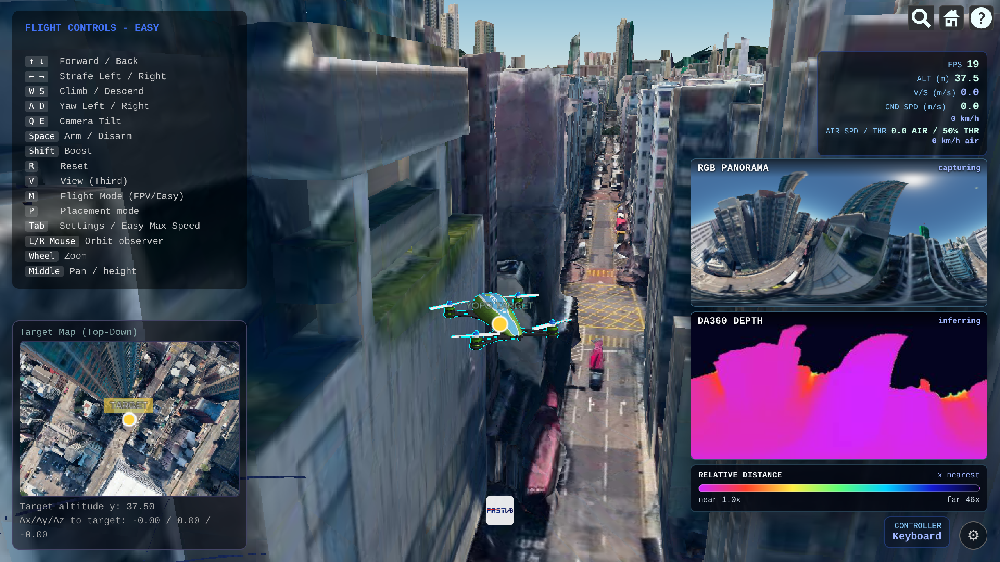

<div align="center">

**🌐 [English](README_EN.md) | [简体中文](README.md)**

</div>

# MindCloud World Fly with YOPO



> **YOPO navigation interface**: the bottom-right corner shows the nose-mounted 360° ERP panorama
> RGB and the DA360 depth map, the bottom-left corner holds the Target Map top-down minimap (the
> drone's position relative to the goal), and the panel on the right picks the goal, starts/stops
> navigation, and displays navigation status, distance to the goal and the inference count.

[🎬 Watch the demos (continuous avoidance 140MB + escape 60MB HD)](https://wuuwuu26.github.io/MindCloud_World_Fly_Private/video_en.html)

A browser-based FPV drone flying through Google Photorealistic 3D Tiles, with YOPO end-to-end
neural-network autonomous navigation (3D obstacle avoidance). Pick a city, place a spawn point,
then fly with the keyboard, a gamepad or an RC transmitter — or set a goal and let YOPO fly there
autonomously. The bottom-right corner shows the nose-mounted 360° ERP panorama RGB and the DA360
depth map.


**Contents**

- [Requirements](#requirements)
- [Quick Start (First-Time Deployment)](#quick-start-first-time-deployment)
- [How to Stop](#how-to-stop)
- [Usage Flow](#usage-flow)
- [Model Weights](#model-weights)
- [Docker Build Notes](#docker-build-notes)
- [Top-Down Minimap (Target Map)](#top-down-minimap-target-map)
- [Coordinate Systems](#coordinate-systems)
- [How the Panoramic Camera Works](#how-the-panoramic-camera-works)
- [DA360 Depth Estimation](#da360-depth-estimation)
- [Depth Map Fed to YOPO](#depth-map-fed-to-yopo)
- [YOPO Autonomous Navigation](#yopo-autonomous-navigation)


## Requirements

Required:

- Docker Engine (recommended 24+), and the current user must be able to run `docker` (i.e. be in the
  `docker` group)
- An NVIDIA GPU + driver (needed by DA360 / YOPO) and the NVIDIA Container Toolkit (for GPU inside
  containers)
- Disk ≥80 GB: the three images total ~64 GB (YOPO ≈35 GB, DA360 ≈28 GB, main flight ≈1 GB), plus the
  1.3 GB DA360 weights
- A modern browser with WebGL support (to open `http://127.0.0.1:8080` and use the simulator)
- The browser must be able to reach Cesium Ion, Google 3D Tiles and `cdn.jsdelivr.net` (the PlayCanvas
  front-end library)

Optional / scenario-specific:

- `curl`: used by `restart_all.sh` to wait for services to be ready (usually present)
- Local development mode (`./launch.sh --local`) needs Python 3
- Downloading the DA360 weights needs Python 3 + pip (`gdown`), network access to Google Drive, and
  `git` (the download script aborts early if `git` is missing)

> Full install commands for first-time deployment are in "Quick Start (First-Time Deployment) → Step 0:
> Install Prerequisites".

### Verified Environment

This project has been fully validated on the following machine (DA360 depth + YOPO navigation +
main flight all brought up together):

| Item | Configuration |
|------|---------------|
| GPU | NVIDIA GeForce RTX 4070 Laptop GPU (8 GB VRAM) |
| Driver / CUDA | 595.84 / 13.2 |
| DA360 config | `DA360_large` + `DA360_INPUT_SCALE=0.65` (model input 672×336), ~92% usage on a single 8GB card |
| YOPO config | TensorRT acceleration, `YOPO_VELOCITY=15` |

> On GPUs with less VRAM (6GB or below), lower `DA360_INPUT_SCALE` or `da360UploadScale` to reduce
> usage; on cards with more headroom you can raise them for better depth accuracy.


## Quick Start (First-Time Deployment)

The steps below take a fresh machine to "manual flight + YOPO autonomous navigation", covering
Docker / NVIDIA Container Toolkit installation, cloning the code, weight download and the first
image build. **After first-time deployment, daily use is just `./restart_all.sh`** (see
"Daily Start / Partial Restart / Stop").

### Step 0: Install Prerequisites

```bash
# 1) Docker Engine (other systems: https://docs.docker.com/engine/install/)
curl -fsSL https://get.docker.com | sh
sudo usermod -aG docker "$USER"    # takes effect after logout/login
newgrp docker                      # or just for the current shell

# 2) NVIDIA driver (must be able to run nvidia-smi)
nvidia-smi

# 3) NVIDIA Container Toolkit (lets containers use the GPU)
sudo apt-get update && sudo apt-get install -y nvidia-container-toolkit
sudo nvidia-ctk runtime configure --runtime=docker
sudo systemctl restart docker

# 4) Verify the GPU is visible inside a container
docker run --rm --gpus all nvidia/cuda:12.1.1-base-ubuntu22.04 nvidia-smi
```

Other requirements:

| Item | Requirement |
|------|-------------|
| Disk | The three images total ~**64 GB** (YOPO ≈35 GB, DA360 ≈28 GB, main flight ≈1 GB), plus the 1.3 GB DA360 weights — **reserve ≥80 GB** |
| Network | First run pulls base images from Docker Hub and weights from Google Drive; the browser must reach Cesium Ion / Google 3D Tiles and `cdn.jsdelivr.net` (PlayCanvas) |
| `curl` | used by `restart_all.sh` to wait for services to be ready (usually present) |
| `python3` + `gdown` | only needed to download the DA360 weights |

> If you only want keyboard flight first (no DA360 / YOPO), skip the GPU and weight steps and just run
> `./launch.sh` — only the ~1 GB main flight image is built.

### Step 1: Clone the Repository

```bash
git clone https://github.com/wuuwuu26/MindCloud_World_Fly_Private.git
cd MindCloud_World_Fly_Private
```

> Note: the DA360 **source code** is version-controlled with this repository (as far as DA360 is
> concerned, `.gitignore` excludes the weights directory `third_party/DA360/checkpoints/` and
> `third_party/DA360/data/images/Thumbs.db`; see the repository-root `.gitignore` for the full
> list), so cloning already gives you the source. The
> **weights** (`DA360_large.pth`, ~1.3GB, over GitHub's 100MB limit) are not in the repository —
> download them in Step 2.

### Step 2: Download the DA360 Depth Weights

The YOPO weights and the TensorRT engine ship with the repo; **only the DA360 weights** (~1.3 GB)
need to be downloaded separately:

```bash
python3 -m pip install --user gdown
./scripts/download_da360_model.sh
# writes third_party/DA360/checkpoints/DA360_large.pth
```

The DA360 source ships with the repo; when the script detects the source it downloads only the weights.

### Step 3: One-Command Startup (first run builds the three images)

```bash
./restart_all.sh
```

It brings up in order: DA360 depth service → YOPO navigation service → main flight process. Each
entry script **only builds the image when it does not exist**, so the first run is slow (mostly
pulling the CUDA base image + installing pip deps, usually tens of minutes); afterwards restarts are
near-instant.

Build/start logs go to:

```bash
tail -f /tmp/restart_da360.log
tail -f /tmp/restart_yopo.log
tail -f /tmp/restart_main.log
```

You can also build a single image ahead of time or on its own:

```bash
./launch.sh                                      # main flight image (builds only if missing; --rebuild to force)
YOPO_FORCE_BUILD=1 ./scripts/start_yopo_api.sh   # YOPO image
DA360_FORCE_BUILD=1 ./scripts/start_da360_api.sh # DA360 image
```

> YOPO inference uses TensorRT acceleration by default (the engine `asset/yopo-trt/yopo_trt.pth`
> ships with the repository). `restart_all.sh` sets `YOPO_USE_TRT=1` **unconditionally**, so no extra
> step is needed; if the engine is missing `scripts/start_yopo_api.sh` builds it with the GPU inside
> the YOPO container.
>
> **The TRT engine is bound to the GPU's SM compute capability**: the shipped engine was built on an
> RTX 4070 Laptop GPU. If your GPU differs (e.g. Orin NX, other desktop cards), delete the existing
> engine before the first start so the startup script rebuilds it for your GPU:
>
> ```bash
> rm asset/yopo-trt/yopo_trt.pth
> ./restart_all.sh
> ```
>
> If the auto-build fails or you need manual control, use the manual conversion command in
> "YOPO TensorRT Acceleration".

### Step 4: Confirm All Three Services Are Alive

```bash
docker ps --format 'table {{.Names}}\t{{.Status}}\t{{.Ports}}'  # you should see the 3 containers below
curl http://127.0.0.1:8080/              # main flight: returns the page HTML
curl http://127.0.0.1:5688/health        # DA360: health check
curl http://127.0.0.1:5689/yopo/status   # YOPO: service status
```

### Step 5: Open the Browser and Take Off

Open `http://127.0.0.1:8080` → click **Start Google 3D Tiles Flight** → pick a city in the search box
→ hold `I` and click the ground to set the spawn point → press `O` to take off. See
"Usage Flow" for details.

### First-Time Deployment FAQ

| Symptom | Cause / Fix |
|---------|-------------|
| `docker: permission denied ...` | current user is not in the `docker` group: `sudo usermod -aG docker $USER` then log out/in |
| `could not select device driver "" with capabilities: [[gpu]]` | NVIDIA Container Toolkit not installed/configured: `sudo nvidia-ctk runtime configure --runtime=docker && sudo systemctl restart docker` |
| Build stuck pulling `pytorch/pytorch:2.1.1-cuda12.1-cudnn8-runtime` | the base image is large and times out on a poor network; the script retries 3× built-in, rerun once the network recovers; or point `YOPO_BASE_IMAGE` / `DA360_BASE_IMAGE` at a mirror / local image |
| pip dependency install fails during build | the build runs with `--network=host`: the YOPO side defaults to the host proxy `127.0.0.1:7890`, the DA360 side forwards the host `HTTP(S)_PROXY` and probes `git config` for a proxy |
| `Port 8080 is already in use` | change port: `PORT=18081 ./launch.sh` or `./launch.sh --port 18081` |
| DA360 stays not-ready for a long time | check `/tmp/restart_da360.log`; if weights are missing the script auto-calls `download_da360_model.sh`; slowness is usually the Google Drive download |
| YOPO first start is slow | with TensorRT enabled but `asset/yopo-trt/yopo_trt.pth` absent, the engine is baked in-container with the GPU and written back to that dir, then loaded directly afterwards |

## How to Stop

Stop all background containers (same stop logic as restart_all.sh, -v cleans anonymous volumes):

```bash
docker rm -fv google-tiles-flight mindcloud-da360-api mindcloud-yopo-api
```

## Usage Flow

1. Click **Start Google 3D Tiles Flight**.
2. Wait for the page to enter **PLACEMENT MODE**.
3. Search for a city or place with the Cesium search box.
4. Hold `I` and click a building, road or the ground to set the spawn point.
5. Fine-tune the horizontal position with `W/A/S/D`; hold `Shift` to speed up the adjustment.
6. Set **SPAWN ALTITUDE (m)**.
7. Press `O` to confirm the spawn point.
8. Choose **First Person** or **Third Person** to start flying.

Common keys:

```text
↑ / ↓       forward / backward
← / →       strafe left / right
W / S       ascend / descend
A / D       yaw left / right
Shift       boost
R           reset
V           cycle view
P           back to placement mode
Tab         settings panel
```

The keyboard works out of the box; gamepads are supported too (but the mapping is yours to tune) and
are usually detected automatically by Chrome's Gamepad API. RC transmitters or WebHID devices can be
connected from the settings panel; to check Linux input permissions:

```bash
./launch.sh --input-status
./launch.sh --setup-input
```

### Goal Selection and Navigation

1. In flight mode, press **`T`** to enter goal selection: the main view switches to a **top-down
   map** with placement-like free camera controls (left-drag pans, middle-drag tilts, wheel zooms).
   The YOPO menu (bottom-left) appears.
2. **Left-click anywhere on the map** to place the goal (click again to adjust).
3. Fine-tune with the **numpad** (directions are relative to the **drone's current nose heading**);
   the Target X/Y/Z inputs stay in sync with the marker live:
   - `Numpad 8 / 2`: forward / backward along the nose
   - `Numpad 4 / 6`: strafe **right / left**, perpendicular to the nose (numlock layout is inverted:
     4 = the drone's right side, 6 = its left; see `handleYOPOKeyDown` in `src/main.js`)
   - `Numpad 9 / 3`: ascend / descend
4. **`Numpad 5`**: confirm the goal and **start navigation automatically** (the follow camera is
   restored).
5. **`Numpad 0`** or **`Esc`**: cancel the selection.

During navigation:
- The drone follows the path with YOPO trajectory commands plus velocity feed-forward
- Moving the sticks temporarily switches to manual control (navigation resumes when released)
- **Avoidance (server-side learning-based + client-side geometric reactive, two layers)**: the
  server strictly follows YOPO and selects the trajectory by `argmin(score)` (learning-based
  avoidance); while tracking the commands, the client additionally stacks a geometric reactive
  potential field (360° ray ring: radial push-away, tangential detour, near-obstacle braking,
  vertical obstacle clearing, detour around vertical obstacle footprints) to cover sudden near
  obstacles during the depth replanning gap. When the horizontal corridor toward the goal is clear
  this geometric layer goes to zero and does not interfere with navigation — see "Avoidance
  Architecture and Tuning".
- Arrival has two layers: the server flags arrival within 2 m of the goal (`ARRIVE_THRESHOLD`); the
  client additionally latches arrival within 6.0 m (distance-only, no speed gate; raised 2.0 -> 6.0 so the takeover engages earlier, before the drone closes in far enough to graze a building with its wing during the final descent), so the asynchronous server reply
  cannot leave it "always one step short"
- Press **`X`** to end navigation

The flight key list lives in the Tab settings panel under **Flight Controls**; the YOPO menu (goal
coordinate inputs, key cheat-sheet, navigation status) stays above the bottom-left target map.


## Model Weights

| Model | Shipped with the repo | How to obtain |
|-------|----------------------|---------------|
| YOPO navigation weights | **Yes** (committed directly, ≤100MB) | Included on clone, under `third_party/yopo/saved/` (default `YOPO_40/epoch50.pth`) |
| YOPO TensorRT engine | **Yes** (committed directly, ≤100MB) | At `asset/yopo-trt/yopo_trt.pth` (fp16); converted from `epoch50.pth`, rebuild when changing GPU/model — see "YOPO TensorRT Acceleration" |
| DA360 depth weights | No (~1.3GB, over the limit) | Download script: `./scripts/download_da360_model.sh` (Google Drive, needs `gdown`) |

### YOPO Navigation Weights

Committed directly to the repository, so after cloning they sit at
`third_party/yopo/saved/YOPO_40/epoch50.pth`. The default path is set in
`scripts/start_yopo_api.sh` (`YOPO_MODEL_PATH`) and can be overridden with an environment variable:

```bash
YOPO_MODEL_PATH=/abs/path/to/your_yopo.pth ./scripts/start_yopo_api.sh
```

### DA360 Depth Weights

A single file exceeds GitHub's 100MB limit, so it is not part of the repository. Run the download
script (install `gdown` first):

```bash
./scripts/download_da360_model.sh
# The script puts the weights at third_party/DA360/checkpoints/DA360_large.pth
```


## Docker Build Notes

The project builds three independent containers, each with its own image name, base image and
rebuild trigger:

| Container | Image | Base image | Measured size | Dockerfile | Entry script |
|-----------|-------|-----------|---------------|------------|--------------|
| Main flight process | `google-tiles-flight` | `tumgis/3dcitydb-web-map:alpine-v2.0.0` (bundles Node + Cesium) | ≈1 GB | `Dockerfile.cesium` | `launch.sh` |
| YOPO avoidance backend | `mindcloud-yopo` | `pytorch/pytorch:2.1.1-cuda12.1-cudnn8-runtime` (CUDA) | ≈35 GB | `Dockerfile.yopo` | `scripts/start_yopo_api.sh` |
| DA360 depth service | `mindcloud-da360` | `pytorch/pytorch:2.1.1-cuda12.1-cudnn8-runtime` (CUDA) | ≈28 GB | `Dockerfile.da360` | `scripts/start_da360_api.sh` |

> Sizes are measured on an RTX 4070 Laptop / Ubuntu 24.04 and are for disk estimation only. Daily
> `./restart_all.sh` does **not** rebuild the images (a build only happens when an image is missing or
> `*_FORCE_BUILD=1` is set). For a standalone or forced build, see "Quick Start (First-Time Deployment)
> → Step 3".

### Main Flight Process (`Dockerfile.cesium`)

- `COPY`s the whole project into `/var/www/google-tiles-flight` inside the container, with
  `CMD ["node", "/var/www/google-tiles-flight/scripts/server.js"]` starting the Express static server
  (which also serves the `/api/path/*.json` gate-route persistence API), `EXPOSE 8000` (host 8080 is
  mapped to container 8000).
- Built from `launch.sh`: it only runs `docker build` when the image does **not** exist or when
  `--rebuild` is passed; otherwise the existing image is reused.
- At runtime `src/` and `index.html` are mounted read-only and `asset/gate-paths` read-write, so
  **changing the frontend JS/HTML never requires an image rebuild** — restart the container and
  hard-refresh the browser (Ctrl+F5).

### YOPO Avoidance Backend (`Dockerfile.yopo`)

- System dependencies: `libgl1-mesa-glx`, `libglib2.0-0`, `ca-certificates`; Python dependencies:
  `numpy<2`, `pillow`, `opencv-python-headless`, `scipy`, `flask`, `flask-cors`, `ruamel.yaml`,
  `websockets`, plus the TensorRT-related `tensorrt==8.6.1.post1` and `onnx`.
- `scripts/yopo_server.py` and `third_party/yopo/` (weights included) are copied straight into the
  image.
- Build/run highlights of `scripts/start_yopo_api.sh`:
  - Builds with `--network=host` so the container's `127.0.0.1:7890` can reach the host proxy for
    pip; the host's `HTTP(S)/FTP/ALL/NO_PROXY` are forwarded as build args (disable with
    `YOPO_PIP_NO_PROXY=1`).
  - Rebuild trigger: the image is missing, or `YOPO_FORCE_BUILD=1`; failures are retried
    `YOPO_BUILD_RETRIES` times (default 3).
  - At runtime the model weights, `yopo_server.py` and the `third_party/yopo` source are mounted
    read-only — **changing the Python or the weights needs no image rebuild**, restarting the
    container is enough.
  - Ports 5689 (HTTP) + 5690 (WebSocket); `--gpus all` by default, `YOPO_GPUS=none` runs on CPU.
  - TensorRT inside the image is pinned to `8.6.1` (compatible with CUDA 12.1 and matching
    `yopo_server`'s TRT 8 load API); the TRT 8.6 pip package ships no cuDNN, so the cuDNN8 bundled
    with torch inside the image provides `libcudnn.so.8` (see `LD_LIBRARY_PATH` in
    `Dockerfile.yopo`). See "YOPO TensorRT Acceleration" for the inference speedup.

### DA360 Depth Service (`Dockerfile.da360`)

- Python dependencies: `numpy<2`, `flask`, `flask-cors`, `opencv-python-headless`, `pillow`,
  `timm`, `tqdm`, `xformers`.
- `COPY third_party/DA360` into the image: the DA360 **source** ships with the repository (both
  `.gitignore` and `.dockerignore` only exclude the DA360 weights directory
  `third_party/DA360/checkpoints/`; see the repository-root `.dockerignore` for the full list), so
  there is nothing to fetch before building. The **weights** `checkpoints/DA360_large.pth` are not
  baked into the image: `scripts/start_da360_api.sh` downloads them (or you mount local weights)
  before running and passes them via `--model-path`.
- Build/run highlights of `scripts/start_da360_api.sh`:
  - Build network and proxy forwarding work the same as for YOPO (`DA360_BUILD_NETWORK`; it also
    probes the host proxy from `git config` as `DA360_BUILD_PROXY`).
  - The image is labelled `mindcloud.da360.server_sha`. There are two skip paths: with the default
    `DA360_MOUNT_SERVER=1` the rebuild is **skipped unconditionally whenever the image exists** (no
    SHA comparison, because the script gets mounted read-only over the same path); with
    `DA360_MOUNT_SERVER=0` it compares the SHA instead — the rebuild is skipped when an image
    exists and the server script SHA matches, and only `DA360_FORCE_BUILD=1` or a changed script
    triggers a rebuild.
  - On build failure it does **not** start a stale image by default (relax with
    `DA360_ALLOW_STALE_IMAGE=1`).
  - Port 5688; `da360_server.py` and the model weights are mounted read-only at runtime.

### Common Causes of Build Timeouts / Failures

- Both CUDA backends build on `pytorch/pytorch:2.1.1-cuda12.1-cudnn8-runtime`, which is very large;
  pulling it from Docker Hub easily times out on a poor network (the failure message of
  `start_da360_api.sh` points this out explicitly).
- Fixes: the script retries 3 times, so just rerun it once the network recovers; or make sure a
  proxy is reachable (on the YOPO side `Dockerfile.yopo` defaults to `127.0.0.1:7890`; the DA360
  side hard-codes no port and only forwards the host's `HTTP(S)/FTP/ALL/NO_PROXY`); or point
  `YOPO_BASE_IMAGE` / `DA360_BASE_IMAGE` at a local or mirrored image.
- If pip dependency installation fails, verify that you build with `--network=host` and that the
  proxy is reachable.

### `.dockerignore`

The build context excludes `.git`, `.gitignore`, `node_modules`, `__pycache__`, `*.pyc`, `scene/*`,
`.DS_Store`, `asset/gate-paths/*.tmp` and `third_party/DA360/checkpoints` (the DA360 weights), keeping
unrelated / large files out of the image; the DA360 source still ships inside the image.


## Top-Down Minimap (Target Map)

A **Target Map (Top-Down)** minimap is permanently docked in the bottom-left corner of the main
interface and refreshes live in flight, giving an intuitive view of the drone's position relative to
the goal:

- **Rendering**: the minimap is drawn by a **separate, second Cesium 3D Tiles viewer** looking almost
  straight down from above the drone (`camera.setView` with `pitch = -89.9°`; Cesium's default
  **perspective** camera, not an orthographic frustum), sharing the same Google Tiles scene
  as the main view and the panorama. It is not a screenshot or an external map tile — it genuinely
  loads a second copy of the 3D Tiles world.
- **Performance (so it does not fight the main view for the GPU)**: the main flight view keeps a
  continuous 60 fps loop (`requestRenderMode: false`); the minimap viewer instead renders on demand —
  it uses `requestRenderMode: true` (it only issues one `requestRender()` per frame after an entity
  position or camera change, instead of redrawing every frame), sets `resolutionScale` to `0.5`
  (half resolution, plenty for a top-down dot map), and is throttled on the frontend to **~15 Hz
  (~every 66 ms)**. Together these cut the second 3D Tiles world's per-second GPU share to roughly a
  quarter.
- Centred on the drone, it shows the drone's current heading and the goal position (two point
  entities: UAV and TARGET) projected onto the horizontal plane. **Note:** no line is drawn between
  the drone and the goal.
- The two text rows below the map give the **target altitude y** (the goal's `y` in the **local
  coordinate system**, i.e. its height above the local origin, in m) and the **Δx/Δy/Δz to target**
  (the goal's east/up/north displacement relative to the drone, in m).
- After entering goal selection mode (press `T`), the map updates in sync with numpad movements of
  the goal, making it easy to align the goal in space.
- The minimap carries no data-attribution watermark; it is drawn purely on the frontend and depends
  on no external map service.


## Coordinate Systems

| Coordinate system | x | y | z | Forward |
|-------------------|---|---|---|---------|
| MindCloud / Cesium | East | Up | North | -z |
| YOPO / ROS FLU | Forward | Left | Up | +x |

Goals are set in the MindCloud coordinate system and converted automatically by the server.


## How the Panoramic Camera Works

The panorama RGB is captured from the nose-mounted 360° camera by default and output as a `384x192`
ERP image. It works by sampling the Cesium/Google Tiles render result in 6 directions and then
re-projecting it on the GPU with the ERP ray model:

```text
yaw   = pi - (u + 0.5) / W * 2pi
pitch = vfov / 2 - (v + 0.5) / H * vfov
```

This keeps the projection model identical to upstream YOPO's ERP camera; the difference is that the
data comes from the Cesium rendered view instead of a direct raycast of a simulated grid. The
panorama sampling viewer is created in the background during placement; after the spawn point is
confirmed, one panorama first frame is pre-sampled before the user takes control. In flight the
defaults are `panoMs=12`, `panoFace=128`, a per-direction wait of `panoFrameDelayMs=8`, and a wait of
up to `panoFaceTileTimeoutMs=140` (`panoFaceTileTimeoutMsFast=110` while navigating) for the tiles of
that direction to go idle; the first-frame preload uses `panoPreloadFrameDelayMs=96`,
`panoPreloadFaceTileTimeoutMs=6000` and `panoPreloadTimeoutMs=60000`, with `panoPreloadRequired=0` by
default, so flight may start even if the first frame is incomplete and live sampling keeps filling it
in (force a complete first frame with `?panoPreloadRequired=1`). To avoid mirage-like artefacts at
the top of the ERP caused by Google Tiles sky / polar sampling, a polar guard is applied to the top
10° and bottom 2° by default; the guard region keeps ERP coordinates and only fades the sampling
toward the poles, without squeezing the whole image onto the guard boundary. Tune or disable it with
`panoTopPoleGuard` / `panoBottomPoleGuard` (set to 0).

Before controllable flight, the main Cesium view preloads the area around the spawn point and waits
for the first-person and third-person initial view tiles to go idle. `flightPreloadStrict=0` by
default, so the main view continues as soon as the coverage of the target area is good enough; the
panorama first-frame preload separately checks that the 6 directions of the hidden viewer are idle.
`panoPreloadRequired=0` by default means flight may start after an incomplete panorama first frame,
with live sampling retrying in the background.

Common parameters:

```text
# Higher output resolution (default is already 384×192; raise to 672/896 with spare VRAM,
# or drop to 320 when bandwidth is tight)
http://127.0.0.1:8080/?panoWidth=896&panoFace=224

# Tune the sampling view wait time
http://127.0.0.1:8080/?panoFrameDelayMs=16&panoPreloadFrameDelayMs=120

# Tune the first-frame panorama preload timeout; or allow flight after a failed first frame
http://127.0.0.1:8080/?panoPreloadTimeoutMs=90000&panoPreloadFaceTileTimeoutMs=9000
http://127.0.0.1:8080/?panoPreloadRequired=0

# Tune the pre-takeoff main view preload radius and coverage threshold
http://127.0.0.1:8080/?flightPreloadRadius=600&flightPreloadMinCoverage=0.98

# Tune the RGB / depth update interval
http://127.0.0.1:8080/?panoMs=1000&depthMs=1200

# Tune the ERP polar guard
http://127.0.0.1:8080/?panoTopPoleGuard=0&panoBottomPoleGuard=0

# DA360 upload size (da360UploadScale defaults to 1.0, i.e. 384×192 uploaded as-is, no scaling)
# Lower it to save bandwidth / raise responsiveness (becomes 192×96); for more accuracy raise
# panoWidth instead of the upload scale
http://127.0.0.1:8080/?da360UploadScale=0.5
http://127.0.0.1:8080/?da360UploadWidth=512
```


## DA360 Depth Estimation

The DA360 depth service is brought up by `restart_all.sh` (using the `large` model by default). The
DA360 **source** ships with the repository, but the **weights** (`DA360_large.pth`, ~1.3GB, over
GitHub's 100MB limit) do not — **downloading the weights is all you need before the first run**
(there is no source to fetch before building the image):

```bash
python3 -m pip install --user gdown
./scripts/download_da360_model.sh
# The script puts the weights at third_party/DA360/checkpoints/DA360_large.pth
```

Heartbeat self-check after startup:

```text
curl http://127.0.0.1:5688/health
```

To stop or restart DA360, just rerun `restart_all.sh` (or `docker rm -fv mindcloud-da360-api`).

Note that `DA360_large` is used by default and `scripts/start_da360_api.sh` starts its container with
`DA360_INPUT_SCALE=0.65`, giving a model input of about `672x336` (checkpoint baseline 1036×518 ×
0.65; verified stable on an RTX 4070 Laptop GPU 8GB; `da360_server.py`'s own default is `1.0`, i.e.
inference at the checkpoint's native resolution).

The panorama RGB is captured at `384x192` ERP by default, and that raw size is exactly what the
bottom-right preview shows. This size is identical to what DA360 outputs and what YOPO consumes, so
`da360UploadScale` defaults to `1.0` — uploaded as-is with no scaling; the server resizes it to the
`672x336` model input, infers, and maps the depth back onto `384x192`. The frontend defaults to
`depthMs=33` (minimum ~30Hz interval between depth requests) and never queues up requests while
inference is still running.

Switching models is not recommended by default; in experiments the fast tier of `DA360_large`
preserves better depth ordering and edge consistency than `DA360_small`. Only override the model
name when VRAM, power or deployment size is constrained:

```bash
DA360_MODEL=<large|base|small> ./scripts/download_da360_model.sh
DA360_MODEL=<large|base|small> ./scripts/start_da360_api.sh
```

To actively change the DA360 server-side model input size, set the inference scale or specify the
model input width/height; too low a `DA360_INPUT_SCALE` can make the large model output banded
depth, so values below `0.46` are discouraged. The resample filter has **different defaults in two
places**: `da360_server.py` itself defaults to `bilinear`, while `scripts/start_da360_api.sh`
overrides it with `bicubic` and forwards it into the container (so `bicubic` is what actually takes
effect when you use the one-shot launcher):

```bash
DA360_INPUT_SCALE=1.0 ./scripts/start_da360_api.sh
DA360_INPUT_SCALE=0.46 ./scripts/start_da360_api.sh
DA360_INPUT_WIDTH=476 ./scripts/start_da360_api.sh
DA360_INPUT_WIDTH=672 DA360_INPUT_HEIGHT=336 ./scripts/start_da360_api.sh
DA360_RESAMPLE=bilinear ./scripts/start_da360_api.sh
```

When the inference service does not run on this machine:

```text
http://127.0.0.1:8080/?da360Url=http://<host>:5688/depth
```


## Depth Map Fed to YOPO

YOPO needs a **384×192 ERP panoramic depth map** (its native input format) with two channels:
channel 0 = normalized depth [0,1], channel 1 = validity mask. The acquisition flow:

1. DA360 panoramic depth estimation → ERP depth map (DA360 **relative** depth, nearest scene point = 1.0, **not** metric)
2. The frontend reprojects/crops it to 384×192 ERP and attaches the validity mask
3. It is fed straight into the network (the depth values themselves come from DA360 and are never
   mixed with ray-synthesised geometric depth; only **up to 6** sparse Cesium rays are used for
   **metric scale calibration** — a forward 2×2 grid plus straight ahead and straight down —
   converting DA360's relative depth into metres)

### Metric Scale Calibration

DA360 outputs **relative_to_nearest** depth (nearest scene point = 1.0), not metric — a global scale
factor `scale` must be estimated so `metric = rel × scale`. The implementation lives in
`src/yopo-depth-from-panorama.js`:

1. **Sample calibration points** (`sampleCalibrationPoints`): fire sparse Cesium rays in the forward
   hemisphere (`world.pickLocalRay`, using the true geometric distance as ground truth).
   - A forward 2×2 grid + straight ahead `(0,0)` + straight down `(0,-1)`, up to 6 rays; the straight-down
     ray's ground distance ≈ altitude, the only reliably-hit direction at high altitude.
   - Calibration rays force `forceFresh=true` for a real GPU pick and **do not** use `pickLocalRay`'s
     directional bucket cache (a cache hit would bring ≤150 ms / ≤0.5 m drift and contaminate calibration).
   - At altitude the max ray distance is scaled up adaptively (`calibMaxDist = max(20, |altitude|×1.5 + 20)`)
     so it still reaches the ground / distant buildings.
2. **Read the corresponding relative depth** (`_samplePanoramaDepth`): map each ray direction to the
   panorama depth-map UV using the ERP layout (`yaw=atan2(x,-z)`, `pitch=asin(y)`) and bilinearly sample
   DA360's relative depth `rel`.
3. **Estimate the scale** (`estimateScale`):
   - Per point compute `ratio = true_dist / rel`, **keeping only near/mid-range points with `rel < 40`** —
     far points / sky can have `rel` in the hundreds, which would crush `scale` to a tiny value (measured
     0.39) and shrink the whole image into "walls everywhere", so they must be filtered out.
   - The ERP main path requires **≥ 3 hit points** this calibration before entering scale estimation
     (`calibrationPoints.length >= 3`); once in, if fewer than 2 valid points remain it falls back to the
     historical `scale` to avoid a single outlier dominating.
   - Take the **median** of the ratios, apply a robust MAD (median absolute deviation) filter to keep
     inliers, and use their mean as `scale`.
   - Clamp for physical plausibility: `scale ∈ [0.5, 30]`; out of range falls back to the historical value.
   - **Temporal smoothing**: `scale = lastScale×0.5 + scale×0.5`, suppressing the scale jumps caused by
     DA360's per-frame relative-depth drift and avoiding network-decision jitter.
4. **Convert**: after resizing to 384×192, per-pixel `metric = rel × scale`; invalid pixels (NaN/≤0) stay
   NaN and are flagged by the mask channel (channel 1), which the network ignores the same way as in
   training.

Calibration runs once per DA360 depth frame (DA360 ≈ 22 Hz < the `pickLocalRay` cache TTL of 150 ms, so
most calibration rays hit the cache and real GPU picks are rare); "move > 1.5 m forces re-calibration"
acts as a CPU-side backstop for cache bypassing, at zero extra cost.

**When depth is unavailable (DA360 failure/timeout) it does not fall back to Cesium raycasting** —
YOPO's network input still requires real depth, so the drone hovers in place and keeps retrying until
a valid depth map arrives and navigation resumes.

> This does not conflict with the client-side geometric reactive avoidance: the latter (see
> "Avoidance Architecture and Tuning") is an independent safety backstop layer that probes live with a
> Cesium ray ring, depends on no DA360 depth, and does not take part in the network input.


## YOPO Autonomous Navigation

Powered by the YOPO end-to-end navigation network, the drone can fly autonomously to a given goal.
YOPO takes the ERP panoramic depth map, odometry and the goal, outputs position/velocity/
acceleration/yaw commands, and drives the drone through the SimpleFlight cascaded PID controller.

### Navigation Architecture (Aligned with Upstream YOPO)

- **Network input**: `depth (1,2,192,384)` (channel 0 = normalized depth, channel 1 = validity mask)
  plus a 9-dimensional observation (camera-frame velocity / acceleration / goal direction),
  expanded by `prepare_input` into `(1,9,6,12)`.
- **Trajectory selection (server: pure YOPO argmin)**: the network outputs the terminal states (PVA)
  and the score of 72 candidate trajectories (12 horizontal × 6 vertical anchors). **The server
  strictly follows the deployment implementation of upstream YOPO's `test_yopo_ros.py` and selects
  the best trajectory with a plain `argmin(score)`,** without stacking any geometric collision cost.
  The first layer of avoidance comes entirely from the score the network learned through
  `safety_loss` during training (**learning-based avoidance**), exactly as in the official
  deployment.
  - **Exception — final-approach takeover**: within `FINAL_APPROACH_DIST = 12.0` m (3D) of the goal the
    server **skips the network inference entirely** and plans with `_plan_final_approach()`, a quintic
    polynomial straight to the goal. So the last 12 m are planned geometrically by the server, not by
    `argmin(score)`. Note this is unrelated to the *client* parameter `yopoFinalApproachDist`, which
    was removed — that was a frontend takeover parameter; this server-side one is still live.
- **Client-side reactive safety layer (geometric potential field)**: on top of the server
  trajectory, the frontend `src/drone.js` adds a geometric reactive avoidance layer based on a Cesium
  ray ring, to cover sudden near obstacles during the depth replanning gap (~70 ms per replan).
  When the path is clear this layer automatically goes to zero and never interferes with the
  network's planning — see "Avoidance Architecture and Tuning".
- **Goal guidance**: the score already contains the goal-direction cost (trained with `wg=0.15`), so
  the network natively points at the goal.
- **3D navigation**: no projection onto the horizontal plane; vertical avoidance is decided by the
  network-predicted z terminal state.
- **Trajectory generation**: three-axis quintic polynomial (Poly5Solver) starting from the last
  commanded state (`plan_from_reference=True`), so trajectories are continuous and never backtrack.
- **Control output**: the polynomial is evaluated at 50 Hz → position / velocity / acceleration +
  yaw → tracked by the frontend cascaded PID.
- **Arrival handling**: the drone tracks the YOPO network trajectory all the way in; only **after arrival is latched** does it switch to a position hold on the goal:
  ```
  const holdKp = 1.5, holdAltKp = 2.5, holdKd = 2.2, holdMaxV = 3.0;
  velTargetX = holdKp * gErrX - holdKd * this.vx;   // position P + velocity damping D
  ... (same on Z; Y uses holdAltKp) ...
  if (vh > holdMaxV) velTarget *= holdMaxV / vh;      // 3 m/s horizontal speed cap
  ```
  (`holdMaxV` was raised 2.0 → 3.0 for a snappier final settle, and `holdKd` 1.5 → 2.2 — above the
  ~2.45 critical value for kp = 1.5, so the faster settle stays overdamped.)
  The D term is kept on purpose: a pure P term would still be carrying speed at the goal → overshoot →
  pull back → sway.
  - **Ray avoidance is now consistent for the whole flight**: the whole family of takeover-zone
    exceptions (`repScale`, `steerFade`, the steering hysteresis, the end-game stand-down) is gone.
    While still navigating (not arrived) the ray layer behaves as in cruise — repulsion, tangential
    detour, braking and vertical clearing all active, with the lateral budget based on
    `max(yopoCruiseMinSpd, commanded speed, detourActive ? yopoDetourSpeedFloor : 0)`; vertical
    safety (`vSafeDown`/`vSafeUp` clearance limits + `crashFloor` + collision handling) always applies.
  - **Near-goal 12 m convergence zone and after arrival**: within 12 m horizontally of the goal the
    `steer` term (`rep + tan`) is zeroed **while the corridor is clear** (`goalClearHyst` is the
    criterion) and `brake` is forced open to 1.0; `vGo` is also blocked (it additionally requires
    `distGoalH ≥ 12 m`). The convergence PD then pins the drone onto the goal column, so a goal
    sitting against a building is not shoved off by the repulsion. **This is "zeroed only when the
    corridor is clear"** — if the corridor is still blocked (e.g. another wall between the drone and
    the goal) `rep`/`tan` keep working and the drone keeps detouring instead of being pinned metres
    short. **After arrival is latched** (`yopoArrived`) `rep`/`tan` are zeroed and `vGo` is off as
    well; what remains is the brake scaling and the vertical floor (`vSafeDown`/`vSafeUp` +
    `crashFloor` + collision handling), with the PD's own vertical speed capped at `holdMaxV = 3.0` so
    a fast dive cannot pass through a side building while descending onto the goal.
  - **Velocity-loop D term** returns to the reference form:
    `velKd = (useAccFeedforward || (stickActive && horizActive)) ? 0.0 : sfVelKd` (off during cruise
    to avoid amplifying network feed-forward jumps, and also off while the sticks are taking over;
    on after arrival where `useAccFeedforward = false` and `velKd = sfVelKd = 1.0` provides damping).
  - **Removed parameters**: `yopoFinalApproachDist`, `yopoFinalApproachVMax`, `yopoGoalRepSuppressDist`,
    `yopoTakeoverSlew`, `yopoTakeoverSteerEndDist`, `yopoArriveDeadbandM`, `yopoArriveVertH`,
    `yopoArriveAltKp`/`AltVMax` (commented in the constructor).
  - **A wall-adjacent goal no longer pins the drone metres short** (still kept): with the goal against
    a wall the forward ray measures `dAhead ≈ distGoalH`; `yopoAvoidGoalGateMargin = 1.0` treats a
    threat within 1 m of the goal's horizontal distance as beyond-goal (the `yopoAvoidGoalBrakeFloor
    = 0.40` floor now covers the `brake = 0` case and the closing gate gains a third release), so the
    drone is not stalled metres short.
- **Depth availability**: when DA360 depth fails or times out it does **not** fall back to raycasting;
  the drone hovers in place and keeps retrying until a valid depth map arrives (see "Depth Map"). The
  frontend depth request timeout is **6 s**; the server additionally has a depth-age based two-stage
  protection (`_SA_DEPTH_AGE_WARN = 0.2 s` slows down, `_SA_DEPTH_AGE_STOP = 1.0 s` stops).
  Note: an earlier version had an "abnormal depth" check that hovered when the whole frame was
  surrounded within 2 m; it mistook "many near pixels" for a depth failure in real urban building
  clusters and hovered constantly, so it was removed to match upstream. Depth validity is now left to
  the mask channel and the network itself.
- **Cruise speed floor (`yopoCruiseMinSpd=12`)**: when the path is clear and the goal is far, it tops
  up the forward speed along the goal bearing so the network cannot squeeze the speed down to a
  crawl; it yields while the avoidance brake is active and switches off within
  `yopoCruiseMinDist=5` m of the goal, respecting the arrival deceleration.
- **Vertical-first direct climb/descent (`yopoVertFirst*`)**: when the height error dominates
  (horizontal distance < 35 m and |Δh| > 4 m and > 0.9× the horizontal offset) it takes over the
  vertical channel with a P-converging climb/descent and keeps only 30% of the horizontal command,
  removing large circling; it yields back to the network when the clearance straight above / below is
  insufficient.
- **Arrival latching**: the server-side 2 m arrival verdict (`ARRIVE_THRESHOLD = 2.0`, 3D distance)
  latches in `main.js` (`cmd.arrived` → `yopoArrived`, released only when the goal is more than
  `YOPO_ARRIVE_RELEASE_M` away — **default 6 m**, overridable with `?yopoArriveReleaseM=`); the client
  additionally has a backstop — within `yopoArriveHoldM = 6.0` m (distance-only, no speed gate — `yopoArriveHoldV` was removed; raised 2.0 -> 6.0 so the takeover engages earlier, before the drone closes in far enough to graze a building with its wing during the final descent) it
  also treats the goal as arrived, avoiding "always one step short" before the asynchronous server verdict
  returns. Once arrived it enters the goal-point position hold described in the arrival-handling section.

### Avoidance Architecture and Tuning

Avoidance has two layers with non-overlapping responsibilities:

| Layer | Location | Mechanism | Role |
|-------|----------|-----------|------|
| Learning-based avoidance | Server `scripts/yopo_server.py` | Network `argmin(score)` trajectory selection (`safety_loss` during training) | Global path planning, steering around large-scale structures |
| Geometric reactive potential field | Frontend `src/drone.js` | Live 360° ray ring (24 rays, 15° spacing) | Covers sudden near obstacles during the depth replanning gap |

How the client-side geometric layer works (see `_avoidanceVelocity`):

- **Probing**: 24 horizontal rays are cast from the body (radius 65 m, 15° spacing); the 3 rays best
  aligned with the forward direction additionally probe **two layers up and one layer down**
  (`high`/`high2`/`low`, 3 layers in total) for the vertical clearing decision; plus straight
  up/straight down vertical rays.
- **Components in detail** (`_avoidanceVelocity`):
  - **rep (radial push-away)**: for every ray with `d < pushRange` a **keep-out-shaped** weight
    `w = clamp((pushRange − d)/(pushRange − yopoAvoidSideStandoff), 0, 1)` (full strength inside the
    10 m standoff, decaying linearly to 0 at `pushRange`, which interpolates 36 → 70 m with speed)
    is accumulated away from the obstacle. The **magnitude is driven by the nearest obstacle, not by
    the ray count**: the weighted sum only supplies the direction, then it is renormalised to
    `yopoAvoidRepGain × closeness(dMin)`. This matters because the raw sum effectively "counts rays"
    — a narrow wall face subtends only 2–4 rays and produced just 2–5 m/s of push-away, which loses
    against a 10–15 m/s goalward command, so the drone ground along the wall face and clipped a wing.
    Afterwards it is scaled by `repHold = clamp(dMin/standoff, yopoRepHoldFloor=0.5, 1)` — the floor is
    **0.5, not 0**, so half of the push is always kept.
  - **tan (tangential detour)**: reference = the nearest obstacle within a ±90° cone around the goal
    bearing (`dotG > yopoTanConeCos`), else the forward-threat direction; of the two perpendiculars,
    the one with the larger projection toward the goal is taken. Strength
    `t = yopoAvoidTanGain × max(0.5, 1 − tanRefD/repRange)` — the **0.5 floor** gives the detour bite
    already at 20–30 m instead of only when the obstacle is on top of the drone. Three anti-chatter
    guards: (1) the direction memory `_avoidLastTan` is honoured when the new tangent differs by
    >120°, the remembered direction is still clear (`dists[i] > yopoAvoidStop + 2.0`), still leads
    toward the goal (`ltToGoal > yopoTanAwayCos`) **and** the new tangent is not more goal-directed
    than the remembered one; (2) a tangent pointing >90° away from the goal is scaled by
    `yopoTanAwayScale = 0.95`; (3) the memory is cleared once the corridor stayed open for 4 frames
    (`goalClearStable`) or on release. tan is modulated by `tanHold = max(repHold, 0.85)` — **floored
    at 85%, i.e. it does NOT decay with `repHold`**, because unlike `rep` it needs *more* authority
    the closer the obstacle is.
  - **vRep (vertical clearing)**: triggers only when the forward horizontal corridor really is blocked
    (`!goalClear` and `dAheadH < yopoAvoidStop + yopoAvoidVBlock` = 26 m) and arrival is not latched
    (`!yopoArrived`) — there is **no near-goal exception**. The direction is decided by a
    **commit/hold state machine**: once `heldDir = +1` (fly over) or `−1` (dive under) is latched it is
    kept until that side is physically sealed (`vUpDist ≤ yopoAvoidStop + 1`, or insufficient
    clearance below) or the obstacle is genuinely passed (`dAheadH > blockDist × 1.5` = 39 m);
    direction flips mid-clear are forbidden, which fixed the "climbs a bit, sinks, climbs again"
    grazing-ray chatter. Fly-over is judged on the straight-up clearance alone
    (`vUpDist > clearD = yopoAvoidRange × yopoAvoidVClear ≈ 24.7 m`) — no upper *side* layer is
    required, because an obstacle taller than today's probe layers is exactly the case that needs
    climbing. Diving under is stricter: low layer `dL > clearD` **and** `groundGap > yopoMinAlt`
    **and** `vDownDist > yopoMinAlt` (10 m). When both are possible, climbing is preferred. As soon as
    the corridor stays open for 4 frames the climb **levels off** (`vClimb = 0`) while `clearHold`
    keeps the altitude until `dAheadH > 39 m` — splitting "stop climbing" from "allow descending" is
    what prevents dropping onto the obstacle just cleared. The climb/dive command is also slewed with
    `vTau = 0.15 s` to avoid a ~28 m/s vertical step.
  - **vGo (detour around a vertical footprint)**: when what is straight below is a *structure* rather
    than terrain (`vDownDist < yopoAvoidVGoThresh` and `groundGap − vDownDist > 1.5`) or straight
    above is blocked (`vUpDist < yopoAvoidVGoThresh`), **and** the corridor is not clear
    (`!goalClear`), **and** arrival is not latched (`!yopoArrived`); the caller additionally requires
    `distGoalH ≥ 12 m`. It pushes toward the emptiest horizontal direction (preferring the forward
    hemisphere, else the global `openDir`) so the drone still advances. Strength
    `strength = yopoAvoidTanGain × (yopoAvoidVGoBase + yopoAvoidVGoSpan × (1 − closeness))`, capped by
    `vGoSafe = √(2 × yopoAvoidVGoDecel × max(0, vGoClear − yopoAvoidStop))` with
    `yopoAvoidVGoDecel = 34.0` (a lateral-roll-specific deceleration far above the forward 3.5; note
    the term is `yopoAvoidStop` = 6.0, **not** `yopoAvoidStopH` = 9.0).
  - **upPush + vSafeDown (ground / descent safety)** as described below.
- **Output components**: `rep` (radial push-away) / `tan` (tangential detour) / `brake` (near-obstacle
  braking) / `vRep` (vertical obstacle clearing) / `vGo` (horizontal detour around a vertical
  obstacle footprint) / `upPush` + `vSafeDown` (ground and descent safety).
- **Braking (the ray layer takes priority over the network)**: the hard kinematic brake
  `v_safe = √(2·a·dEff)` plans a safe speed, with `dEff = brakeClear − standoff − reactionDist` and
  `a` the conservative `yopoAvoidBrakeDecel = 3.5 m/s²` (6.5 → 4.5 → 3.5; **only ever lower it** — a
  smaller planned deceleration makes the brake engage earlier and demand a lower target speed; it
  also drives the closing-speed gate `vCloseMax` and the proximity governor). The reaction distance
  `reactionDist = spdFwd × reactionSec` subtracts the dead time, with `yopoAvoidBrakeReaction = 0.46 s`
  base and `yopoAvoidBrakeReactionHi = 1.25 s` at speed — at 15 m/s that is ~15 m of extra lead. When
  braking fires it (1) **suppresses the YOPO network's acceleration feed-forward** (otherwise the
  network trajectory's acceleration pushes straight into the obstacle and cancels the braking
  deceleration), (2) injects the strongest deceleration feed-forward directly opposite the current
  velocity (up to `yopoAvoidBrakeAccel≈17.0 m/s²`, matching the 60° tilt ceiling
  `droneMaxAngle=60`), delivering at least `yopoAvoidBrakeMinFrac=0.85` (≈14.5 m/s²) as soon as
  braking starts, and (3) boosts the attitude-loop gain by `yopoAvoidBrakeAngleGain = 2.2` whenever
  `brake < yopoAvoidBrakeUrgent = 0.7`, cutting the ~0.28 s needed to slew from the cruise tilt to
  the braking tilt. The brake value itself is **asymmetrically filtered**: tightening applies
  instantly, release ramps back with `tau = 0.30 s`, so probe noise cannot turn the speed target into
  a sawtooth. The threat distance `dAhead` takes the **smaller** of the "network-commanded direction"
  and the "drone's actual heading", so the network cannot turn the command aside and thereby exclude
  an obstacle straight ahead and skip braking.
- **Lateral speed budget**: while detouring, "forward" and "lateral detour" are budgeted separately —
  lateral takes at most 77% of the budget base and forward keeps at least 20%, so the velocity
  vector really tilts tangentially and slides along the obstacle instead of "charging at full speed
  while grazing it". The budget base is
  `max(yopoCruiseMinSpd, actual commanded speed, detourActive ? yopoDetourSpeedFloor : 0)` — the
  third term (a detour is in play when `|rep + tan| > 1.5 m/s`) raises the base to 40 m/s so the
  slide-around is as decisive as flying over; the forward gate is **not** raised by it. Keying the
  budget to the commanded speed alone made the detour collapse exactly when it was needed (commanded
  8 m/s → only ~5.4 m/s of steering authority). Also, **tan is NOT decayed by `repHold`**
  (`tanHold = max(repHold, 0.85)`): `repHold = clamp(dMin/standoff, 0.5, 1)` scales the field down
  close to an obstacle — right for `rep` ("once stopped, do not keep pushing away") but backwards for
  `tan`, which needs MORE authority the closer the obstacle is.
- **Clear straight flight (`goalClear`)**: a corridor is measured along "body → goal" (`dPath`) and
  along the "commanded velocity direction" (`dCmd`) separately, with a corridor half-width of 2.5 m;
  **either** corridor being clear within `reach = min(yopoAvoidRepRange, horizontal distance to the
  goal)` counts as clear (truncating at the goal keeps a wall *behind* the goal from permanently
  blocking the corridor). Near-goal exception: within `yopoCorridorGuardDist` (**18 m**) of the goal,
  if `dPath` is blocked then the `dCmd` escape hatch is refused, so the drone cannot charge straight
  at an obstacle that is only a few metres away. 18 m (up from 12) is required because it must cover
  the release threshold `releaseDAhead = standoff + reactionDist + 2.0` (~12 m): otherwise a detour
  mid-swing with `dPath` hovering around that boundary flaps between "release → charge" and
  "re-arm → detour", which is the observed left-right sway and never getting around. The verdict is
  additionally debounced before it may release: `releaseAllowed` needs 2 consecutive clear frames and
  drops after 3 consecutive blocked frames (the probe refreshes every 40 ms and grazing rays flip the
  raw verdict frame to frame), and `goalClearStable` (4 frames) drives the tangent-memory drop and
  the climb level-off. **When the corridor is clear, `rep`/`tan`/`brake`/`vRep` all go to zero and
  `vGo` is suppressed**, so the drone flies straight at the goal at full speed, never pushed away or
  detouring without reason.

#### Wing-envelope guard (reserve the wingspan in every direction)

The wing is a rigid body with a physical span: even when the body centre already keeps the `yopoAvoidStopH` standoff from an obstacle, the wingtips can still be clipped by a nearby building on the side / at an oblique angle — especially while descending through a corridor that looks "clear" for the body. So before the geometric layer zeroes `rep`/`tan`/`brake`/`vRep` and lets the drone fly straight at the goal (the "release"), it runs an extra **wingspan-envelope guard** so the release cannot clip a wing against a side obstacle.

Envelope radius = `yopoAvoidStopH` (9.0 m) + `yopoWingMargin` (3.0 m) = **12 m**: a 12 m wingspan safety circle is reserved around the body in every direction.

The guard has two layers (both with hysteresis: asserted only after 2 consecutive occupying frames, cleared only after 3 consecutive clear frames, to avoid probe-noise chatter / crawling):

- **Descent guard (along the goal bearing)**: active only when "not in the near-goal zone (≥ 12 m from goal), actually descending, the goal is below the body (a true vertical approach), and the nearest obstacle `dMin < 12 m`". It takes the nearest obstacle's projection `projN` and lateral offset `latOff` onto the goal bearing; the lateral repulsion is kept only when the obstacle is "ahead of the goal (`projN>0` and `dMin·projN ≤` the goal's horizontal distance)" AND "its lateral offset < `yopoWingMargin`" — i.e. only an obstacle that could actually clip a wing blocks the release. Otherwise (an obstacle far to the side, outside the real span) it is released, avoiding "clear path yet shoved away".
- **Omnidirectional guard (level / climb / descent, every ray direction)**: it walks all **24** horizontal rays; if ANY direction finds an obstacle inside the 12 m envelope that is NOT beyond the goal (along-goal distance ≤ the goal's horizontal distance — i.e. not the wall the goal sits against) and not clearly behind (`dotG > −0.3`), it sets `_avoidSideKeepOn`, which stops the release logic from zeroing the lateral `rep`. So in level flight, climb or descent alike, the wing position on any side is reserved — the drone does not mis-release just because the body-centre corridor is clear and then graze a wing. The forward-corridor brake is still governed by `dAheadH`, so a side wall only makes the drone hold its offset, never crawl.
- **Two-tier release (Tier 1 / Tier 2)**: with the corridor clear and the wing guard not asserted, the
  release is **Tier 1** — `rep`/`tan`/`brake`/`vRep` are all zeroed and `vGo` is suppressed, so the
  drone flies straight at full speed. When the wing envelope still holds an obstacle (guard asserted)
  it is **Tier 2** — `rep` is **kept** (it holds the lateral offset from the wall) and the brake is
  opened, while `tan` is kept or zeroed depending on whether that obstacle is **still in front of the
  drone**: during the envelope scan each obstacle is classified by its along-goal cosine
  (`dotG > 0.2` = "still ahead", latched with the same 2/3-frame hysteresis as `_avoidSideAheadOn`).
  Still ahead → keep `tan` so the rounding arc is completed ("detour a bit then stop, never getting
  around"); abeam or behind → zero `tan`, because keeping it produced "the corridor is completely
  clear yet it still detours". Both tiers clear the tangent direction memory `_avoidLastTan`.

Inside the 12 m near-goal convergence zone both guards are disengaged: the convergence PD pins the drone to the goal column and `goalClear`'s corridor is authoritative, so the release cannot clip a wing; the wall the goal sits against is judged "beyond the goal" and also released, so the drone can still land on a goal point next to a wall.

Caller interaction: while descending, if the wing guard is keeping the lateral repulsion (`avoid.wingKeepActive`), that `rep` is treated as "wingspan reservation" rather than "mid-detour", so the altitude is NOT frozen (`velTargetY` is not forced to 0). The drone descends while holding its lateral separation from the wall — fixing the "won't descend to a clear-below goal next to a wall" regression.

Key parameters (all in the `src/drone.js` constructor):

| Parameter | Default | Meaning |
|-----------|---------|---------|
| `yopoAvoidEnabled` | `true` | Master switch of the geometric layer |
| `yopoAvoidRayCount` | 24 | Number of 360° rays (15° spacing). **Raised from 12**: at 30° spacing the lateral gap between adjacent rays is `2·d·sin15° ≈ 0.52·d` (~10 m at 20 m, ~15 m at 30 m), so a 10–15 m wide building could sit entirely between two rays, the corridor verdict never saw it and the drone charged straight into it. 15° narrows the gap to ~5 m at 20 m. Only the GPU pick count grows (negligible next to the 200 ms–1 s network inference); drop to 16 if the frame rate suffers |
| `yopoAvoidFastSpeed` | 6.0 | Speed (m/s) at which the high-speed profile starts (wider repulsion / detour / brake action ranges, denser probe throttle) |
| `yopoAvoidRefSpeed` | 15.0 | Speed (m/s) at which the high-speed profile is fully applied; interpolates the action ranges (rays are **not** downsampled with speed) |
| `yopoAvoidStrideHi` | 2 | **Retired** (ray tiering removed): was the high-speed stride; all 24 directions are now probed every cycle |
| `yopoAvoidCoreDeg` | 25 | **Retired** (ray tiering removed): no core / outer cone split any more |
| `yopoAvoidConeDeg` / `ConeDegHi` | 55 / 55 | **Retired** (ray tiering removed): the whole ring is probed every cycle |
| `yopoAvoidSliceMax` | 12 | **Retired** (ray tiering removed): no "not probed this cycle" direction any more |
| `yopoAvoidRange` | 65.0 | Obstacle detection radius (m); ray length is free, lengthening only helps |
| `yopoAvoidRepRange` | 28.0 | Repulsion / tangential / braking range (m); also `goalClear`'s clear threshold — do **not** raise |
| `yopoAvoidRepRangeHi` | 60.0 | The same range at `yopoAvoidRefSpeed` (m) |
| `yopoAvoidRepGain` | 34.0 | Maximum radial push-away speed (m/s) |
| `yopoAvoidTanGain` | 120.0 | Tangential detour gain (m/s); higher = more decisive detour |
| `yopoTanConeCos` | 0.0 | Only use obstacles within a ±90° cone around the goal bearing as the detour reference, so buildings behind/beside cannot steer it off (widened from 0.17 so obstacles further to the side still trigger a detour) |
| `yopoTanAwayCos` | -0.5 | Drop the remembered tangent only when it points >120° away from the goal, allowing a turn back (loosened from -0.2: the direction memory survives longer mid-detour, so the detour does not switch sides easily) |
| `yopoTanAwayScale` | 0.95 | Scale applied to a tangent pointing >90° away from the goal, avoiding being pushed off the goal (0.78 → 0.85 → 0.95, keeping more detour authority while rounding a wide obstacle) |
| `yopoSteerCapFrac` | 0.77 | Fraction of the speed budget the lateral detour may consume (lateral speed cap = budget base x this). Forward budget is decoupled and squeezed, so raising it only enlarges the slide-around authority, never the charge-in. |
| `yopoDetourSpeedFloor` | 40.0 | Horizontal speed floor (m/s) while a detour is actually in play: raises the decisiveness of the slide-around so the horizontal detour is as strong as the vertical clearing (vRep); the forward gate is NOT raised by this. |
| `yopoAvoidDecel` | 8.5 | **Inert (kept for config compatibility)**: the real vertical deceleration is `aDecel = min(yopoAvoidVDecel, yopoAccMax) × 0.9 = 9.9`, which is what `vSafeUp` / `vSafeDown` / `upPush` actually use |
| `yopoAvoidVDecel` | 13.0 | **Vertical** assumed deceleration (m/s²): min'ed with `yopoAccMax` (11) and scaled by 0.9 into the actual `aDecel` (9.9). The thrust axis brakes far harder than the forward tilt axis, hence much higher than `yopoAvoidBrakeDecel` |
| `yopoAvoidBrakeDecel` | 3.5 | *Horizontal* brake planning deceleration (m/s²): deliberately far below the reachable value to leave ~2× margin (6.5 → 4.5 → 3.5). It drives `vSafe`, the closing-speed gate `vCloseMax` **and** the proximity governor: lower it to brake earlier, never raise it |
| `yopoAvoidBrakeAccel` | 17.0 | Max *actual* deceleration the ray layer may command while braking (m/s²): matches the 60° tilt ceiling (`droneMaxAngle=60`). It injects a deceleration feed-forward opposing velocity and **suppresses the network's acceleration feed-forward** |
| `yopoAvoidBrakeMinFrac` | 0.85 | Deliver at least 0.85×`BrakeAccel` (≈14.5 m/s²) as soon as braking starts |
| `yopoAvoidBrakeReaction` | 0.46 / 1.25 | Brake reaction time (s): base / high-speed (≥ `yopoAvoidRefSpeed`). The high-speed value went 0.80 → 1.00 → 1.25, i.e. ~15 m of extra braking lead at 15 m/s |
| `yopoAvoidBrakeRange` / `BrakeRangeHi` | 30.0 / 54.0 | Progressive soft-brake zone (m): low / high speed (raised to 30.0 together with `yopoAvoidStopH` 6→7.5→9.0 so the `(brakeClear − standoff×2)` normalisation does not degenerate) |
| `yopoAvoidBrakeFloor` | 0.78 | Soft-brake speed floor ratio (still decelerates when close, without over-compressing the cruise); lowered from 0.85 so the approach eases off earlier |
| `yopoAvoidBrakeAngleGain` | 2.2 | Attitude-loop gain multiplier while braking: cuts the ~0.28 s slew from the cruise tilt to the braking tilt to ~0.12 s, so 17 m/s² is actually reached while there is still room |
| `yopoAvoidBrakeUrgent` | 0.7 | The gain boost above only engages below this `brake` value (a real emergency stop or the closing gate firing), so cruise never gets the extra gain |
| `yopoRepHoldFloor` | 0.5 | Floor of `repHold = clamp(dMin/standoff, ·, 1)`: close to an obstacle `rep` keeps at least half of its strength instead of going to zero |
| `yopoAvoidVGoDecel` | 34.0 | vGo's lateral-roll-specific deceleration (m/s²), far above the forward 3.5, so leaving an underfoot/overhead footprint is not throttled to ~3 m/s |
| `yopoAvoidSideStandoff` | 10.0 | **Lateral** desired clearance (m): the distance held off walls / building faces; the keep-out repulsion runs at full strength within 10 m (reverted from 13.0 to 10.0: prevents the detour from being steered back once abreast of the obstacle) |
| `yopoAvoidStopH` | 9.0 | **Horizontal** brake safety standoff (m): drives the forward brake standoff and the repulsion decay — keeps further off walls / buildings (raised 6.0 → 7.5 → 9.0 per request) |
| `yopoWingMargin` | 3.0 | **Wingspan-envelope** extra lateral margin (m): stacked on `yopoAvoidStopH` to form the 12 m wing guard envelope (`StopH + WingMargin`); before releasing, if any ray finds an obstacle inside the envelope that is not beyond the goal, the lateral repulsion is kept to avoid clipping a wingtip |
| `yopoAvoidStop` | 6.0 | **Vertical UP** safety clearance (m): drives the up-clearance brake `vSafeUp`, the vertical-clearing block distance and the vGo `vGoSafe` cap. The **downward** direction has its own `yopoAvoidStopDown`. Deliberately NOT raised with StopH, because a clearance below it would over-restrict climbing / over-head clearance |
| `yopoAvoidStopDown` | 10.0 | **Down (descent)** safety clearance (m), SEPARATE from `yopoAvoidStop`: drives only `vSafeDown` (the descent kinematic brake against an obstacle straight below). Decoupled from `yopoAvoidStop` (lowered 8.0 → 5.0 then raised to 7.0, and widened to 10.0 this change to remove the "skim the rooftop while overflying" window), keeps margin above an obstacle below while descending; does NOT affect the up / over-head clearance nor the horizontal avoidance. |
| `yopoMinAlt` | 10.0 | Minimum ground/roof clearance (m): below it the upward push engages (2.5 → 3.0 → 4.0 → 8.0 → 10.0). When flying OVER a rooftop the binding clearance is the straight-down ray `vDownDist`: with under 10.0 m to the rooftop below the drone is pushed up, holding ~10 m of vertical margin instead of skimming the rooftop. |
| `yopoAvoidVClimbScale` | 2.2 | Vertical clearing climb strength |
| `yopoAvoidVBlock` | 20.0 | Forward clearance below which vertical clearing triggers (m) |
| `yopoAvoidVGoBase` / `VGoSpan` | 0.85 / 0.60 | Near / far strength of the "leave the footprint" speed (vGo) for an obstacle underfoot |
| `yopoAvoidVClear` | 0.38 | Fraction above which an upper layer counts as clear; lower = stronger clearing willingness |
| `yopoCorridorGuardDist` | 18.0 | Near-goal corridor guard (m): within this distance, a blocked goal-bearing corridor forces braking even if the velocity-direction corridor is clear. Raised from 12.0 — it must cover the release threshold `releaseDAhead ≈ 12 m`, or a detour mid-swing flaps between "release → charge" and "re-arm → detour" (the left-right sway, never getting around) |
| `yopoCruiseMinSpd` | 12.0 | Cruise speed floor (m/s): tops up forward speed along the goal bearing when the path is clear and the goal is far; yields while braking |
| `yopoCruiseMinDist` | 5.0 | Distance to the goal below which the cruise floor is switched off, respecting the arrival deceleration |
| `yopoVertFirstEnabled` | `true` | Master switch of the cruise-phase "vertical-first" direct climb/descent |
| `yopoVertClearR` | 16.0 | Horizontal-openness radius (m) for descent: a vertical descent may only begin when no obstacle lies within this radius in any horizontal direction (dMin > this, i.e. "truly open"); otherwise the drone holds altitude and keeps detouring until the area is clear, then descends. Waived within `yopoVertFirstHDist` × 0.5 of the goal so the final arrival can still descend. |
| `droneMaxVSpeed` | 15.0 | Hard vertical speed ceiling (m/s) |
| `droneMaxAngle` | 60 | Maximum tilt angle (°): the physical tilt ceiling |


#### High-speed responsiveness (ray budget & adaptive action range)

The root cause of "avoidance is too late + depth/command updates are too slow when flying fast" is a
single choke point: every `pickLocalRay` is a full GPU scene render plus a read-back stall and runs
synchronously inside the render frame loop. To cut the pick count the rays used to be split into
**freshness tiers** (the core cone picked with `forceFresh`, everything else served from the
`pickLocalRay` cache: 0.5 m origin quantisation + direction bucket + 150 ms TTL) and into
core / cone / periphery groups with high-speed stride downsampling and round-robin periphery slices.

**Those optimisations are now removed — probe determinism beats frame rate.** Both the cache and the
tiering let a direction keep a distance measured from a *different position or an older cycle*: at
cruise speed the drone covers several metres per cycle, so a stale or interpolated distance computes
the braking distance wrong and shows up as "an obstacle is right there, yet it still plans a big speed
straight into it" (the avoidance layer is bypassed). Therefore:

- **All directions, every cycle, all fresh**: the 24 horizontal rays (`yopoAvoidRayCount`) are each
  picked for real **every cycle** (`forceFresh=true`, no cache), with no stride downsampling, no
  round-robin rotation and no mirrored neighbour filling.
- **Vertical layers (high/high2/low) emitted every cycle**: 3 layers along each of the 3 forward-most
  rays (+9 rays), and no longer gated by the previous cycle's "corridor blocked" verdict — that
  one-cycle-old gate used to stop vertical clearing from ever triggering.
- **Straight up / down**: 1 fresh ray each per cycle (ceiling / floor safety cannot tolerate a stale
  value), no longer skipped "every N cycles".

Throttling still lives in `_updateAvoidProbe`: above `yopoAvoidFastSpeed` a cycle every
**`yopoAvoidQueryMs = 40 ms`** (≈25 Hz), relaxing linearly to **≤400 ms** at rest (≈2.5 Hz); the
previous result is reused while the drone has barely moved (`moved < 0.4 m` and `|Δy| < 2 m`)
**and** the previous probe is still within the reuse window (`min(120, 2×queryMs)` ms at speed,
900 ms at rest). That is **cycle-level throttling**, not a ray cache.

`yopoAvoidStrideHi` / `yopoAvoidCoreDeg` / `yopoAvoidConeDeg` / `ConeDegHi` / `yopoAvoidSliceMax` /
`yopoAvoidVertEvery` are **all retired** (their assignments are kept only so external / UI overrides
stay harmless); `_computeAvoidProbe` no longer reads them. `yopoAvoidFastSpeed` / `yopoAvoidRefSpeed`
are still live and now only interpolate the **action ranges** (`repRange` / `brakeRange` /
`pushRange`) and the probe throttle — they no longer affect ray sampling.

| Parameter | Default | Meaning |
|-----------|---------|---------|
| `yopoAvoidRange` | 65.0 | Obstacle detection radius (m); ray length is free, so lengthening only helps |
| `yopoAvoidFastSpeed` | 6.0 | Speed (m/s) at which the high-speed profile starts |
| `yopoAvoidRefSpeed` | 15.0 | Speed (m/s) at which the high-speed profile is fully applied |
| `yopoAvoidStrideHi` | 2 | **Retired** (ray tiering removed): no stride downsampling any more |
| `yopoAvoidCoreDeg` | 25 | **Retired** (ray tiering removed): no core cone concept |
| `yopoAvoidConeDeg` / `ConeDegHi` | 55 / 55 | **Retired** (ray tiering removed): no outer cone concept |
| `yopoAvoidSliceMax` | 12 | **Retired** (ray tiering removed): no round-robin slices any more |
| `yopoAvoidRepRangeHi` | 60.0 | Repulsion/detour/brake action range at speed (m) |
| `yopoAvoidTanGain` | 120.0 | Tangential detour gain (m/s), more decisive than 12 |
| `yopoAvoidRepGain` | 34.0 | Maximum radial push-away speed (m/s), more decisive than 18 |
| `yopoAvoidBrakeRangeHi` | 54.0 | Soft-brake start distance at speed (m) |
| `yopoAvoidBrakeReaction` | 1.25 | Brake reaction time at speed (s): the lag (attitude build-up + control loop) is converted to a reaction distance `spd × reaction` subtracted from the stopping room, so at 15 m/s braking starts ~15 m earlier and still stops inside the standoff (base tier is 0.46 s) |

Measured rays emitted per cycle: **24 horizontal + 9 vertical-layer + 2 straight up/down = 35 rays,
all of them fresh GPU picks** (there is no longer a "cache hit costs no pick" part; when `lowOk` is
false the low layer is not emitted, giving 32).
`yopoAvoidRepRange` (= `goalClear`'s clear threshold) does **not** scale with speed, so widening the
high-speed action range does not make "the path is actually clear" get misjudged as blocked. Run
`__yopoPerf()` in the browser console to read live metrics (`fps` / `probeMsAvg` / `probeHz` /
`depthHz` / `cmdHz` / `ringAgeMaxMs`).

### Key YOPO Backend Environment Variables

All variables below except `YOPO_SPEED_CAP` are forwarded into the container by
`scripts/start_yopo_api.sh` via `docker run -e`:

| Variable | Default / recommended | Description |
|----------|----------------------|-------------|
| `YOPO_VELOCITY` | 15.0 (set by `restart_all.sh`) | Network planned cruise speed `vel_max` (m/s), which decides the actual flight speed; falls back to the yaml config when unset |
| `YOPO_CTRL_TIME_SCALE` | 1.0 (`restart_all.sh` sets `1`) | Command "fast forward" factor. `>1` advances at `vel_max × SCALE` (2 gives ≈30 m/s); it is clamped back by `YOPO_SPEED_CAP`, but the planned position runs ahead and the drone lags behind permanently, so keep it at 1 |
| `YOPO_SPEED_CAP` | 15.0 | Absolute hard ceiling of the commanded speed (m/s), guaranteeing "no speed limit ever goes above 15 m/s". **Note: this variable is NOT in `start_yopo_api.sh`'s `docker run -e` list**, so setting it on the host has no effect on the container (the built-in 15.0 in `yopo_server.py` always wins); change it in the server script, or run in local (`--local`) mode |
| `YOPO_TRAJ_EXTEND_S` | 2.0 | Trajectory tail extrapolation time (s), fixing the command-freeze sawtooth during replan intervals; if replanning still has not happened after that, it falls back to the frozen behaviour to avoid flying blind forever |
| `YOPO_USE_TRT` | 1 (set by `restart_all.sh`) | TensorRT acceleration switch, see "YOPO TensorRT Acceleration". Note `yopo_server.py` itself defaults to `0`; the launcher sets it to 1 when the engine exists, and `restart_all.sh` sets it unconditionally |

> The reactive-budget speed governor (which used to cap speed dynamically by the replan interval) was
> removed: flight speed is decided directly by `YOPO_VELOCITY × YOPO_CTRL_TIME_SCALE` and hard-clamped
> by `YOPO_SPEED_CAP`; avoidance is now guaranteed jointly by "server-side network `argmin(score)` +
> client-side geometric reactive potential field" (see "Avoidance Architecture and Tuning").

### YOPO TensorRT Acceleration

YOPO inference uses TensorRT (TRT) acceleration by default. Freezing `epoch50.pth` into an fp16
engine drops the per-inference latency from ~100-350 ms (PyTorch eager) to 1-5 ms, making
replanning more frequent, the blind-flight segments shorter and avoidance smoother.

- **Engine path**: `asset/yopo-trt/yopo_trt.pth` (committed; fp16, tied to this machine's GPU
  architecture).
- **One-step enable**: `restart_all.sh` sets `YOPO_USE_TRT=1` unconditionally, and the backend log
  prints `[TensorRT] loaded … -- inference acceleration enabled` after startup. Note that the
  assignment in `restart_all.sh` is hard-coded, so `YOPO_USE_TRT=0 ./restart_all.sh` has **no
  effect**; to force the PyTorch eager fallback, call the backend script directly:
  ```bash
  YOPO_USE_TRT=0 ./scripts/start_yopo_api.sh
  ```
  (`scripts/start_yopo_api.sh` only auto-detects the engine when `YOPO_USE_TRT` is unset: enable it
  if the engine exists, otherwise fall back to PyTorch eager.)
- **Automatic build**: if TRT is enabled but the engine is missing,
  `scripts/start_yopo_api.sh` uses the GPU inside the YOPO container to freeze the current model
  (`YOPO_MODEL_PATH`, default `epoch50.pth`) into an engine and writes it to `asset/yopo-trt/`
  (mounted read-write); the next start loads it directly, no manual preprocessing needed.
- **Manual conversion**: when changing the model or rebuilding the engine, run the conversion script
  inside a GPU-enabled container (`scripts/yopo_trt_transfer.py`: `epoch50.pth` →
  `torch.onnx.export` (`depth[1,2,192,384]` + `obs[1,9,6,12]`) → TRT fp16 engine, compatible with
  TRT 8.x / 10+):
  ```bash
  docker run --rm --gpus all \
    -v "$PWD/third_party/yopo:/opt/mindcloud-yopo/third_party/yopo:ro" \
    -v "$PWD/scripts/yopo_trt_transfer.py:/opt/mindcloud-yopo/scripts/yopo_trt_transfer.py:ro" \
    -v "$PWD/third_party/yopo/saved/YOPO_40/epoch50.pth:/models/epoch50.pth:ro" \
    -v "$PWD/asset/yopo-trt:/opt/mindcloud-yopo/trt:rw" \
    mindcloud-yopo:latest python /opt/mindcloud-yopo/scripts/yopo_trt_transfer.py \
      --model /models/epoch50.pth --out /opt/mindcloud-yopo/trt/yopo_trt.pth
  ```
- **Changing GPU / architecture**: a TRT engine is tied to the GPU's SM compute capability, and the
  current engine was built on an RTX 4070. When deploying to an Orin NX or another card, delete the
  old engine on the target machine and let `start_yopo_api.sh` rebuild it (or rerun the command
  above).
- **Environment constraint**: TensorRT inside the container is pinned to `8.6.1` (matching the CUDA
  12.1 runtime and `yopo_server`'s TRT 8 load API); the TRT 8.6 pip package ships no cuDNN, so the
  cuDNN8 bundled with torch inside the image provides `libcudnn.so.8` (see `LD_LIBRARY_PATH` in
  `Dockerfile.yopo`).
